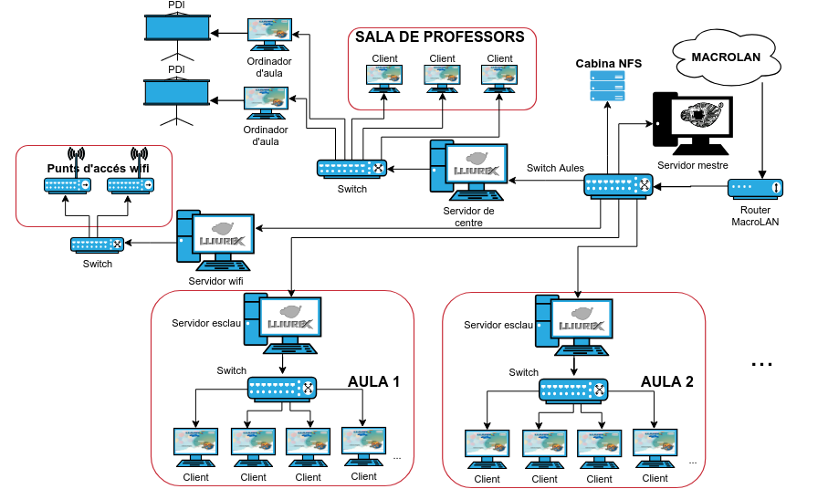

# Tema 1: Introducción a Lliurex

## Introducción
En este tema veremos qué es LliureX y qué características generales tiene; conoceremos los sabores o adaptaciones de LliureX, es decir, de cuántas formas se presenta este sistema operativo; también veremos una cosa muy importante, como encontrar información y ayuda para cualquier cosa relacionada con LliureX; a continuación explicaremos las 4 posibilidades que hay para ponerse manos a la obra; finalmente veremos las razones por las cuales Lliurex es bueno frente a otros sistemas.

## ¿Qué es Lliurex?
LliureX es el proyecto de la Consellería de Educación, Cultura y Deporte de la Generalitat que tiene como objetivo principal la introducción de las TIC en el sistema educativo Valenciano. El proyecto consiste en la creación y mantenimiento de un conjunto de sistema operativo y aplicaciones, basado en software libre, y denominado del mismo modo. Este conjunto de aplicaciones con sistema operativo es conocido con el nombre de distribución GNU/Linux.

Lliurex está basado en la última LTS de Ubuntu (long-term support). Por ejemplo, Llx19 deriva de la Ubuntu 18.04 LTS, cuyo soporte termina el 04-2023. La Llx21, que deriva de Ubuntu 20.04 LTS, su soporte termina el 04-2025. La diferencia entre ambas distribuciones radica en las actualizaciones del sistema base así como su gestor gráfico Plasma. Las aplicaciones desarrolladas por el equipo Lliurex son idénticas.

Con respecto al rendimiento del SO, los recursos utilizados por ambos SO son iguales. El equipo Lliurex se encarga de que el SO pueda correr en equipos dotados por la Conselleria de hasta 8 años de antigüedad.

El futuro de Lliurex está garantizado. No obstante, en futuro se preveen el desarrollos de diferentes programas y aplicaciones para su integración en la nube de Microsoft.

## Sabores de Lliurex
Los diferentes sabores de LliureX son adaptaciones del sistema operativo para diferentes necesidades. Dependiendo de las características del centro o del conjunto de equipos en los cuales se instalará LliureX, se optará por unos sabores u otros.
A la hora de elegir qué sabor queremos instalar en uno o varios equipos, hay que distinguir de qué modo estarán conectados los ordenadores en la red, si lo harán para funcionar de forma independiente o bien si formarán parte de una red más grande como la de una aula de informática o la red interna de todo un centro:

    * Ordenadores independientes. Elegiríamos algunos de los siguientes sabores:

        * Escritorio

        * Infantil

        * Música
        * FP

    * Aula Informática. Elegiríamos los sabores:

        * Servidor (o servidor FP)

        * Cliente (o cliente FP)

    * Todo el Centro Educativo. Podríamos usar los mismos sabores que para una aula, siempre atendido el diseño propuesto en el modelo de centro LliureX.

### Escritorio
LliureX Escritorio (o Desktop) es la adaptación genérica, diseñada para los ordenadores personales, de la sala de profesores, secretarías… Es decir, está destinada a ser instalada en los ordenadores que no dependen de un servidor (que no están dentro del aula de informática, o en biblioteca…) como por ejemplo equipos portátiles y ordenadores personales.

### FP
LliureX FP es una adaptación que se ha desarrollado para su uso en ciclos formativos, con software específico para las diferentes ramas. En esta distribución, se han eliminado los programas orientados a los niveles educativos de infantil, primaria y secundaria, que no resultarían de utilidad en este ámbito. La adaptación para FP dispone de 3 imágenes ISO para descargar: la versión para un ordenador independiente (escritorio) y las versiones para aula de informática (servidor y cliente).

### Cliente
LliureX Cliente de aula es la adaptación para los clientes de las aulas. Está destinada a todos aquellos ordenadores que están conectados a un servidor LliureX bien sea en un modelo de centro o un modelo de aula tradicional. A diferencia de la adaptación para escritorio, este sí que necesita los servicios de un servidor para determinadas acciones.

### Servidor
LliureX Servidor es la adaptación para los servidores de las aulas, los cuales ofrecen servicios a los clientes y controlan su actividad.

LliureX Servidor es, además, la adaptación para los servidores de centro, los cuales se encargan, entre otras cosas, de coordinar todos los servidores de las diferentes aulas.

## Modelo de red
Hay que tener presente que los sabores Cliente y Servidor se han diseñado para formar parte de una infraestructura de red concreta como la que se dispone en los centros educativos. Se trata de redes cableadas con la posibilidad de tener diferentes redes independientes dentro de un mismo edificio. Los diferentes modelos de red ideados porque funciono la combinación de sabores Servidor-Cliente son:
Modelo de aula

LliureX Modelo de Aula se ha diseñado para las aulas de informática. El servidor y los clientes forman una red independiente, donde el servidor proporciona servicios centralizados y al cual se pueden conectar, tanto clientes pesados, como semiligeros y ligeros.

El Modelo de Aula LliureX incluye software para controlar la actividad del alumnado en el aula, herramientas administrativas, y una gran cantidad de aplicaciones educativas.
Modelo de centro

LliureX Modelo de Centro (con versión para servidores y clientes) amplía el tradicional modelo de aula. En el modelo de aula, las aulas de informática forman una red independiente que dispone de un servidor al cual se pueden conectar tanto estaciones de trabajo como clientes ligeros (clientes). El nuevo modelo de centro, además, permite el interconexionado de las diferentes aulas con un servidor de centro. Encontraréis más información sobre el modelo de centro en la Wiki de LliureX.

# Donde encontrar información y ayuda
Los principales lugares donde encontrar información son: el portal web de LliureX en PortalEdu, La Wiki de LliureX, y el foro. Además, existe una gran comunidad de usuarios, recordamos que LliureX es utilizado en los centros educativos valencianos desde hace más de quince años y, a lo largo de este tiempo, se han constituido grupos y foros de personas muchas de las cuales siempre están dispuestos a ayudar altruistamente en lo que sea.

Si usamos LliureX desde un centro educativo público valenciano, también hay apoyo de software por parte del SAI.

## Portal Lliurex
El [Portal Lliurex](https://portal.edu.gva.es/lliurex/) es un sitio web dentro del portal educativo PortalEdu que aglutina toda la información relacionada con el proyecto LliureX. Desde ahí podemos descargar las diferentes ISOs, por ejemplo.

## Wiki LliureX
La [Wiki de LliureX](https://wiki.edu.gva.es/lliurex/tiki-index.php) es el sitio web donde podéis encontrar la documentación oficial de LliureX. En este repositorio encontraréis manuales, instrucciones, información sobre aplicaciones, configuraciones específicas, etc. Cualquier clase de información para resolver las dudas que os surjan en LliureX.

## Foro
El [foro de LliureX](https://mestreacasa.gva.es/web/lliurex/forums) es uno de los mejores lugares donde encontrar ayuda para LliureX, puesto que no solo podemos encontrar información útil ya publicada sino que podemos hacer preguntas sobre cualquier tema del cual necesitamos ayuda, incluso podemos ir más allá y, si podemos, ayudar a otras personas respondiendo las dudas que ellas plantean. Es decir, se trata de una herramienta de comunicación asíncrona en grupo, a la manera de cualquier otro foro de discusión que se puede encontrar en internet sobre cualquier tema. Está alojado en la plataforma Mestreacasa.

## Comunidad Lliurex
Existen diversos grupos de Telegram dónde podemos compartir información y dudas, aunque son extraoficiales:
* [Comunitat Lliurex](http://t.me/comunitat_lliurex). Un grupo público de una red privada formado mayoritariamente por personal docente valenciano de diferentes niveles educativos y en el cual participan activamente algunos desarrolladores del equipo LliureX.
* [InformáTICa CV](http://t.me/informaTICaCV). Otro grupo similar con presencia mayoritaria de profesorado de informática de la Comunidad Valenciana.
* [Edutictac](http://t.me/edutictac). Una comunidad de docentes, con diferentes proyectos y herramientas de ayuda con las TIC en educación.

## SAI
La Consellería de Educación y la DGTIC proporcionan en la comunidad educativa un servicio para la resolución de todas las incidencias TIC bajo la denominación SAI: Soporte y Asistencia Informática. Si se está usando LliureX en un ordenador de un centro público valenciano se puede solicitar este servicio desde la aplicación Gestión de incidencias. El catálogo de servicios del SAI incluye diferentes posibles situaciones en las cuales se podría pedir ayuda técnica relacionada con LliureX, tanto de software como de hardware.

## Referencias
Contenido extraído de https://portal.edu.gva.es/curslliurex/va/tema-1-presentant-lliurex-19/