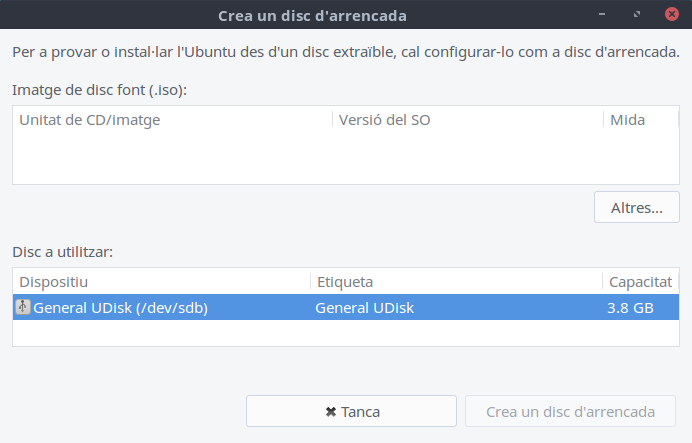
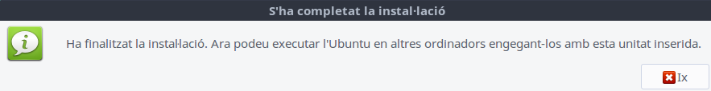
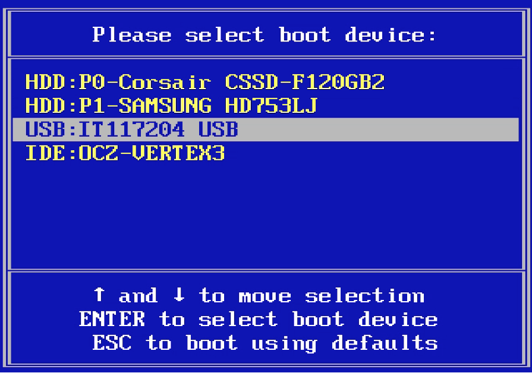
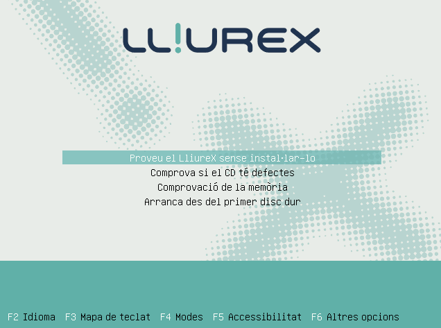

# Tema 2: Instalando Lliurex
## Introducción
En este apartado veremos como instalar una versión limpia (from scratch) de Lliurex.
El proceso general para lo cual será el siguiente:

    1. Obtención de una imagen ISO de LliureX desde la web
    2. Creación de un USB de arranque con LliureX
    3. Arranque desde USB e instalación del sistema

Hay que tener en cuenta que si queremos instalar LliureX en un ordenador que ya tiene un sistema operativo previamente instalado, como pueda ser Windows, nos tendremos que asegurar de tener espacio suficiente en disco para instalar LliureX. A pesar de que una instalación limpia ocupa unos 13 GB, sería conveniente disponer de un mínimo de 20-30 GB libres al disco.

## Obtención de la ISO de LliureX

Para descargar LliureX, accederemos a la sección de descargas de la página web de LliureX:

En esta página, veremos que podemos descargar cualquier Sabor de las diferentes versiones de LliureX.

Para descargar la versión de escritorio, abriremos el desplegable correspondiente al sabor (la barra con el texto Escritorio y el signo +), y después en el botón de descarga del sistema en 64 bits:

Una vez hacemos clic, se iniciará la descarga a nuestro ordenador. Esto puede tardar un tiempo, puesto que se trata de un fichero de un peso considerable.

El fichero descargado, será un fichero con extensión .iso, que tendremos que volcar sobre una memoria USB con espacio suficiente, para arrancar nuestro ordenador con él.

## Creación de un USB de arranque

Una vez disponemos de la imagen .iso descargada, tendremos que volcarla a un dispositivo de memoria USB. Como que este fichero ocupa 3.3 Gb, con una memoria USB de 4 GB debería de ser suficiente, pero podemos utilizar una de mayor capacidad. Hay que tener en cuenta que esta memoria USB se utilizará de forma exclussiva para el volcado de la imagen, por el que cualquier fichero que contenga será borrado.

A los siguientes puntos, vamos a ver como generar este USB de arranque tanto desde LliureX como desde Windows.

### Creación del USB de arranque con LliureX/Ubuntu

Si queremos crear el USB de arranque desde un ordenador con LliureX o Ubuntu, lo haremos a través de la herramienta Startup Disk Creator. A la wiki de LliureX tenemos descrito este proceso.

Lo que tendremos que hacer es buscar esta aplicación desde el menú de inicio (Sistema > Startup Disk Creator) y ejecutarla:

La pantalla principal de esta aplicación nos muestra dos secciones: la parte superior, con la lista de imágenes iso que conoce la aplicación (Imagen de Disco Font), y la parte inferior (Disco a utilizar), con la lista de memorias USB conectadas en ese momento. Para crear el USB de arranque, tendremos que tenerlo conectado antes de iniciar la aplicación para qué esta lo detecto.

Inicialmente, si no nos aparece el fichero .iso que hemos descargado en la lista superior, haremos clic en Otros, y buscaremos dentro de nuestro ordenador la imagen que hemos descargado (generalmente en la carpeta de Descargas).

Hecho esto, nos tendremos que asegurar que tenemos a la parte superior seleccionada la imagen de LliureX que hemos descargado, y a la parte inferior seleccionado el dispositivo sobre el qué queremos crear la imarge. Si todo es correcto, tendremos que hacer clic al botón Crea un disco de arranque para iniciar el proceso.

En este momento, después de un posible mensaje advirtiendo de la pérdida de datos de la memoria USB, se nos mostrará una barra con el progreso de la creación. Cuando esté finalizando, es posible que tengamos que introducir la contraseña del usuario administrador, para hacer el USB arrancable.

Finalmente, nos mostrará la siguiente ventana indicando que ha finalizado el proceso.

Con esto ya tendremos el USB preparado para arrancar el ordenador con un sistema live de LliureX.

### Arranque desde el USB e instalación de LliureX

El siguiente paso es arrancar nuestro ordenador desde el dispositivo USB que hemos creado. Para lo cual tendremos que poner en marcha nuestro ordenador con la memoria USB conectada, y acceder al menú de arranque del sistema.

Cada fabricante utiliza una tecla diferente para acceder al menú de arranque. A la siguiente tabla se muestran las teclas más habituales para acceder al menú de arranque para diferentes fabricantes:
 	

| Marca del ordenador         | Tecla Boot Menu |
|:--------------|:-----|
|Acero 	| F12|
|Asus 	|Esc o F8, según modelos|
|Dell 	|F12|
|Fujitsu |	F12|
|Gateway |	F12|
|HP 	|Esc|
|Huawei |	F12|
|Intel NUDO |	F10|
|Lenovo |	F12|
|Samsung |	Esc|
|Sony 	|F11, Esc, F10 según modelos|
|Toshiba |	F12 |

Cuando reiniciamos el ordenador y pulsamos la tecla correspondiente a nuestro equipo, se nos mostrará un menú similar al siguiente, al qué tendremos que indicar que queremos arrancar desde el USB que hemos creado:

Una vez seleccionada la opción, arrancaremos desde el USB, que nos cargará una versión Live de LliureX para poder probarlo e instalarlo.

Vemos a continuación las diferentes pantallas que se nos presentan y las diferentes opciones de instalación que tenemos:

Pantalla de arranque de LliureX Live: En esta primera pantalla cuando arrancamos desde el USB tendremos que pulsar una tecla para iniciar la sesión Live de LliureX. Si no pulsamos ninguna tecla, el sistema se iniciará desde el disco duro del ordenador.

Menú de inicio del sistema Live, con diferentes opciones, como hacer un testeo de memoria o comproar si el CD/USB de instalación tiene defectos. Elegiremos la opción Probar LliureX sin instalarlo, para iniciar el modo live y desde ahí empezar la instalación.

En caso de que tengamos el modo UEFI activado en nuestro ordenador, es posible que estas opciones de arranque cambien, dando opción a iniciar LliureX Live en modo UEFI o bien a instalar directamente el sistema. En este caso, podemos bien lanzar directamente el instalador o bien arrancar la sesión Live, y desde esta instalar LliureX directamente. Disponéis de un extenso artículo en la wiki de LliureX sobre qué es UEFI y cómo activarlo y desactivarlo al ordenador.

LliureX Live: Se iniciará LliureX en modo Live desde el USB, y a partir de aquí podremos iniciar la instalación. Para lo cual haremos doble clic al icono Instala la versión LliureX que aparece en el Escritorio.

Instalador de LliureX: Ahora se iniciará el instalador de LliureX. La primera ventana de este asistente de instalación nos pedirá qué idioma deseamos para la instalación y el sistema.

Selección de la distribución del teclado, en este caso, elegiremos la Disposición en Español y la variante del catalán para tener habilitado el punto medio (el de la ele geminada l·l).

Selección de la distribución del escritorio, donde podremos elegir qué apariencia queremos darle a nuestro escritorio LliureX. Tenemos dos opciones. La primero es la distribución por defecto (Default Layout), con una barra superior y el dock a la parte inferior, tal y como se ha estado trabajando en las últimas versiones de LliureX. La segunda opción es una distribución más clásica (Classic Layout) con una única barra a la parte inferior. En principio escogeremos la distribución por defecto.

Selección de software adicional, en principio no tendremos que instalar este software por defecto, por el que no marcaremos nada y pulsaremos en Continua.

Complementos del sistema, desde donde podremos habilitar el apoyo de flash, así como el envío de estadísticas de uso de LliureX de forma anónima y el servicio de inventario, para recoger información del hardware. En nuestro caso, dejaremos marcado el apoyo de flash y el uso de estadítiques.

Tipo de instalación. Este es uno de los puntos más delicados de la instalación, y es donde decidiremos la parte de disco que vamos a dedicar a LliureX. El propio particionador ya nos sugerirá la distribución que considero más adecuada según el espacio que encuentra disponible en el disco duro bajo la opción de particionamento guiado.

Cuando hablamos de particiones hacemos referencia a las partes en que dividimos, de forma lógica, un disco duro de forma que es cómo si tuvieramos tantos discos duros como particiones. Cada sistema operativo necesita ubicar su sistema de ficheros en una de estas particiones. En esta ventana de Tipo de instalación tenemos varias opciones para hacer estas particiones:

* Guiado - redimensiona disco y utiliza el espacio libre, que será la opción recomendada, siempre que el particionador encuentro espacio suficiente en el disco como para hacer la instalación. A la instalación de ejemplo que estamos haciendo se ha utilizado este sistema, sobre un disco que ya tenía varias particiones. El sistema ha detectado la partición donde más espacio disponible había y nos ha sugerido reducir esta y crear una nueva para instalar LliureX. Cómo vemos a la imagen, se nos muestra el estado actual del disco, y como quedaría después de hacer la nueva partición. En esta barra de abajo, fijaos que aparece una flecha doble entre la partición que vayamos a redimensionar y la nueva por sí queremos ajustar los espacios. Si deseáis ajustar el espacio, acordaros de dejar unos 20GB para la partición con LliureX.

* Guiado - utiliza el disco entero. En este caso, se borraría todo el contenido del disco, y lo utilizaría completamente para LliureX.

* Guiado - utiliza el disco entero y configura LVM, es parecido al anterior pero utilizando volúmenes lógicos ( LVM, Logical Volume Manager), que gestiona varias particiones como si se tratara de una.

* Guiado - utiliza el disco entero y configura LVM cifrado, que seria como el anterior, pero cifrando el disco.

* Manual, es la opción más versátil y potente, puesto que nos permite gestionar las particiones a nuestro gusto, y por tanto, la más peligrosa si no sabemos muy bien qué estamos haciendo.

Lo más recomendable, será pues, seguir el modo guiado que nos sugiere el reparticionamento del disco.

Una vez elegimos el tipo de instalación nos mostrará el siguiente mensaje advirtiendo que se van a hacer cambios al disco, y pidiendo confirmación:

Una vez le damos a Continuar el sistema empezará a instalarse, mientras sigue el asistente para configurar el sistema.

Selección de la ubicación. La siguiente ventana nos pregunta la región donde estamos, para establecer el huso horario correctamente. A la parte inferior de la ventana, podremos ver el progreso de la instalación.

Configuración del usuario primario. En la siguiente ventana configuraremos el nombre del usuario primario (que tendrá permiso de administrador), su contraseña y así como el nombre del sistema. Además, determinaremos si hace falta una contraseña para entrar al ordenador. Indicaremos nuestro nombre, el nombre de usuario que utilizaremos, nuestra contraseña (dos veces) y que sí que queremos una contraseña para entrar.

Últimos pasos de la instalación. Una vez configurado el sistema, este sigue con su instalación. Mientras lo hace, nos muestra las principales novedades de la versión. Ahora tendremos que esperar un tiempo para que el sistema esté instalado por completo.

Cuando finaliza la instalación por completo, nos muestra la siguiente ventana informándonos, y pidiéndonos si queremos reiniciar el equipo o seguir con la prueba. Elegimos la opción de reiniciar, y quitamos el USB cuando nos diga el sistema. Cuando el ordenador se inicie de nuevo, nos mostrará el menú de inicio, al cual podremos elegir qué sistema operativo iniciar.

