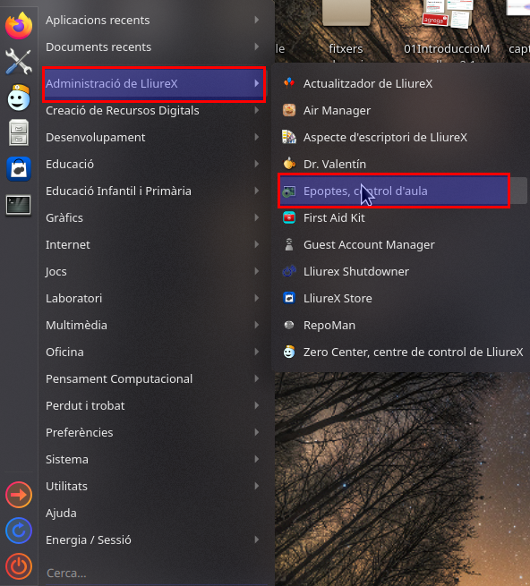

# Tema 3: Herramientas para la docencia

## Introducción
Este tema trata más herramientas básicas, en este caso educativas. Te explicamos una serie de aplicaciones que están preinstaladas en LLiurex y que pueden ser válidas para tu día a día docente.

## Epoptes
Epoptes,  se utiliza para el control del aula, es una herramienta mediante la cual se pueden realizar tareas de control en los clientes de la red del aula de informática. Para acceder solo tenemos que ir al menú y pulsar en >administración de LLiurex>Epoptes:

Accederemos con un usuario profesor poniendo la contraseña que haga falta y accederemos al programa:
<iframe width="1056" height="1000" src="https://www.youtube.com/embed/FLXAdshFaTk" title="YouTube video player" frameborder="0" allow="accelerometer; autoplay; clipboard-write; encrypted-media; gyroscope; picture-in-picture" allowfullscreen></iframe>

Se nos abre una ventana con toda una serie de opciones que os definimos a continuación:

Visto esto, nos centraremos en cada apartado por separado; para seguir un orden, primero en el más básico para después ir pasando a los que suponen algo más de dificultad. Cómo veis hay algunos que no están marcados en la imagen, podéis descubrir su funcionalidad pasando con el ratón por encima de cada icono como veréis en los diferentes videos que os exponemos a continuación.

1.- Apagar y reiniciar los ordenadores del alumnado

Solo tenemos que seleccionar los equipos de los alumnos que queremos apagar o reiniciar.

    Para seleccionar un equipo pinchamos encima de su icono y se selecciona.
    Para seleccionar más de un equipo pulsamos la tecla control y hacemos clic con el ratón encima de los diferentes equipos que aparecen en la pantalla y que queramos elegir.
    Para seleccionar todos los equipos solo hay que desmarcar los que estén seleccionados para que la orden se ejecute en cada uno de ellos.

Podéis verlo de una manera gráfica en el siguiente videotutorial:

 

2.- Controlar el ordenador de un alumno.

En este caso solo podemos realizar la acción en uno de los equipos, puesto que lo que hacemos es coger el control del ordenador de un alumno. Muy buena opción para alumnado pequeño o con poco dominio del ratón o de la computadora.

3.- Mostrar la pantalla del usuario profesor en los equipos del alumnado.

A veces hay que hacer una explicación de un tema concreto; con esta opción podemos mostrar la pantalla del usuario profesor al alumno que: ha perdido el ritmo de la clase, que hace falta que esté pendiente de un procedimiento de resolución de una tarea o cualquier otra cuestión. Del mismo modo que en el punto 1, podemos seleccionar uno, varios o todos los equipos para mostrarles nuestra pantalla.

4.- Bloquear desbloquear la pantalla del alumnado.

Es muy útil para qué se centre la atención en lo que se está hablando en ese momento; aparece un candado a la pantalla del equipo cliente. Solo se bloquea la pantalla; los programas que estaban ejecutándose en el momento no dejan de funcionar. Del mismo modo que en el punto 1, podemos seleccionar uno, varios o todos los equipos para bloquearles su pantalla.

5.- Enviar un mensaje a uno o más usuario/a.

Con esta opción podemos enviar un mensaje escrito al equipo o equipos que consideramos. Del mismo modo que en el punto 1, podemos seleccionar uno, varios o todos los equipos para enviarles un mensaje.

6.- Ejecutar un programa, documento o página web en el equipo del alumno.

Muy útil para alumnado pequeño que no sabe leer o con un nivel bajo de dominio del equipo. Del mismo modo que en su punto 1, podemos seleccionar uno, varios o todos los equipos para enviarles la página o el fichero. En el caso del video vemos como enviar una URL de una página web concreta.

 

Aprovecho para agradecer el CEIP Ribalta de Algemesí que me dejara hacer uso de sus instalaciones para poder grabar los videotutorials utilizados en esta entrada.