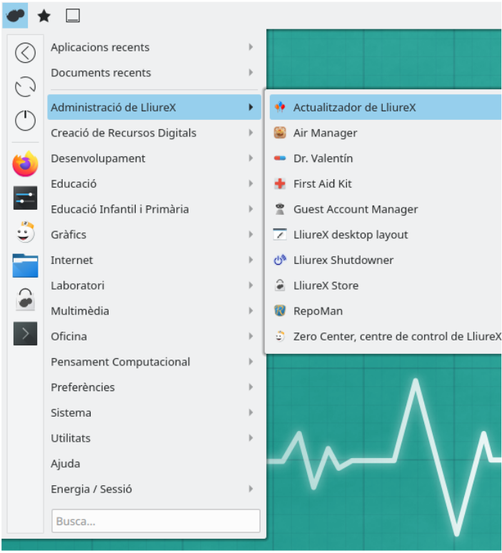
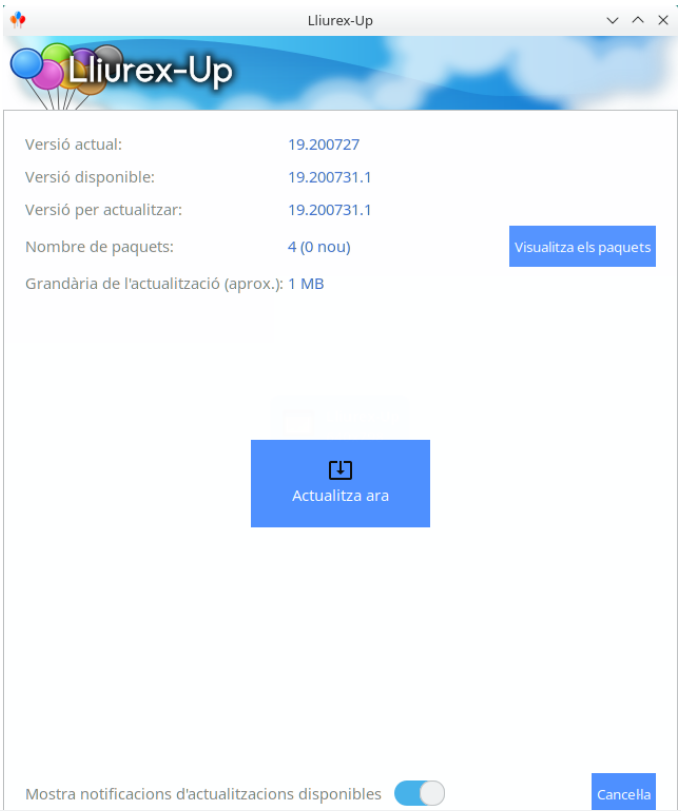

# Tema 4: Administrando Lliurex
## Introducción
En esta unidad veremos qué carpetas se sincronizan con el servidor así cómo actualizar/instalar/desinstalar los paquetes en Lliurex. Además, cuando un usuario cambia su layout de escritorio (desaparecen elementos como la barra de inicio, escritorio vacío...), veremos cómo resolverlo. Finalmente, ahondaremos en la resolución de conflictos o problemas que pudieran dar los clientes (o ordenadores escritorio).

## Carpetas que se sincronizan  con el servidor
La carpeta personal de un usuario de red está estructurada de la siguiente manera:
* Descargas
* Documentos
* Escritorio
* Compartido
* Compartido de grupos
* Datos de alumnos (sólo para cuentas del profesorado) 

Además de éstas, existen otras en las que se mantiene la configuración personal de algunos programas, temática de escritorio, etc. que también se sincronizan con el servidor gracias al programa Perfiles móviles.

Debemos tener en mente que las carpetas que se sincronizan con el servidor son la carpeta **Documentos** y la carpeta **Escritorio**.
### Compartido
Esta carpeta contiene ficheros compartidos para todo el aula. Sólo el profesorado y el administrador netadmin del aula tienen permisos de escritura en esta carpeta, mientras que el alumnado únicamente tiene permisos de lectura. 

### Compartido de grupos
Compartido de grupos es una carpeta similar a Compartido con la peculiaridad de que ésta está organizada por grupos, cada uno de los cuales tiene la suya propia. Así, por ejemplo, un alumno o alumna del grupo 3ESOA sólo podrá acceder a la carpeta 3ESOA. Al igual que Compartido, sólo el profesorado y el administrador del aula tienen permisos de escritura en este directorio.

### Datos alumno
La carpeta datos alumnos permite acceder a los ficheros contenidos en los directorios Documentos y Escritorio del alumnado del sistema.

### ¿Cuál es la ruta (path) dónde se encuentran estas carpetas de red?
Podemos hallar todas estas carpetas de red en el servidor en:
> /net/server-sync

## Reestablecer perfil
Los usuarios, tanto en los clientes como en el servidor pueden modificar su layout de escritorio, mover, añadir, eliminar elementos. Por ejemplo, lo más frecuente es que se elimine la barra de tareas, que integra el menú de aplicaciones. Entonces, ¿qué podemos hacer para que vuelva a aparecer o reestablecer los elementos por defecto.

La reestauración del perfil del usuario se debe ejecutar en el propio entorno del cliente, es decir, con la sesión iniciada. Para ello, podemos buscar dentro del **zero-center** el programa **LliureX-PerfilReset**.

Debemos hacer clic en Reestablecer perfil y esperar 60 segundos, aproximadamente. Tras reiniciar la sesión, el escritorio volverá a mostrar la configuración original por defecto.

 Si no se dispone de menú de aplicaciones, podemos lanzar el programa mediante línia de comandos. Para ello pulsamos:
> Control+ALT+T

Se nos abrirá el terminal y escribimos:
> lliurex-perfilreset

## Gestión de software
Las aplicaciones se componen de varios ficheros, tanto ejecutables como de configuración o recursos, como puedan ser las imágenes, iconos, o documentos. Cuando instalamos una aplicación, todos estos recursos se ubican a su lugar respectivo dentro del sistema.

Las aplicaciones se componen de varios ficheros, tanto ejecutables como de configuración o recursos, como puedan ser las imágenes, iconos, o documentos. Cuando instalamos una aplicación, todos estos recursos se ubican a su lugar respectivo dentro del sistema.

La forma que tienen los sistemas GNU/Linux de distribuir y gestionar las aplicaciones es mediante lo que se conocen como paquetes. Un paquete es un fichero comprimido, que contiene, además de los ficheros necesarios información sobre este (versión, desarrollador, web, etc.). 

El sistema de paquetes utilizados de forma natural en Ubuntu y por tanto en LliureX es del formato Debian un fichero comprimido con extensión .deb, que contiene toda esta información y los ficheros.

En los últimos años, se han incorporado otros sistemas de distribución de paquetes, como el formato Snap o Appimage, que presentan menos problemas en cuanto a dependencias con otros paquetes, pero que pueden tener un peso considerablemente superior a los .deb.

### Actualizar Lliurex
#### Lliurex Up
LliureX Up es el actualizador de LliureX, por el que no es en sí una herramienta para obtener software nuevo, sino para actualizar el que ya tenemos.

Cuando hay actualizaciones disponibles, LliureX Up nos lo indicará a la bandeja del sistema, y nos permitirá descargar e instalar todas las nuevas versiones del software que ya tenemos instalado.

Es una buena práctica mantener actualizado nuestro sistema, tanto por las actualizaciones de seguridad que resuelven problemas del software que tenemos instalado, como por nuevas funcionalidades.

Para acceder al LliureX Up, lo haremos a través del menú de Inicio > Administración de LliureX > Actualizador de LliureX:

Nada más lanzar el actualizador, se realizarán varias acciones para refrescar todas las listas de paquetes disponibles a los repositorios. El sistema de paquetes, mantiene unas listas con todo el software disponible a los repositorios, y lo primero que hace LliureX Up al iniciarse es actualizar estas listas. Después compara las aplicaciones que tenemos instaladas con estas listas, para detectar si hay versiones nuevas para instalar.

Si tenemos alguna actualización disponible, el sistema nos mostrará la versión actual de LliureX (cada actualización de cualquier paquete a los repositorios de LliureX implica un cambio en la versión general). A la siguiente imagen podemos ver que tenemos la versión 19.200727, pero está disponible la 19.200731.1. También nos dice que tenemos 4 paquetes para actualizar (podemos ver cuáles son con el botón Visualiza los paquetes) y el tamaño de esta actualización.

Cuando hacemos clic al botón Actualiza ahora, empezará la actualización de los paquetes, y nos avisará cuando acabe.

Además, disponemos de una herramienta por línea de comandos llamada **lliurex-upgrade**. Esta herramienta actualiza los paquetes y el propio sistema operativo sin necesidad de GUI.

### Instalación y desinstalación de paquetes
Para la instalación de paquetes podemos usar:
* apt install
* Discover
* Lliurex Store

## Procesos en background (daemon)
> Ver los procesos que hay en background y que pueden causar conflictos e inconvenientes con el software instalado. Por ejemplo, hay software que una vez instalado ¡se desinstala solo!

Mediante un comando podemos visualizar en el terminal el estado de un daemon o servicio en background.

> service --status-all

Nos devuelve el estado de todos los servicios. El estado [ + ] significa que está corriendo favorablemente, [ - ] nos indica que ha sido parado y [ ? ] nos indica que tiene un estado desconocido.

Con esta información, podemos ejecutar:

> systemctl status <servicio>

Esto nos devolverá más información sobre el estado del servicio. Si el servicio no se ha podido ejecutar, podríamos ver el fichero de logs mientras se intenta arrancar el servicio, usando dos terminales diferentes.

> Terminal1: $ sudo tail -f /var/log/syslog

> Terminal2: $ sudo systemctl restart <servicio>