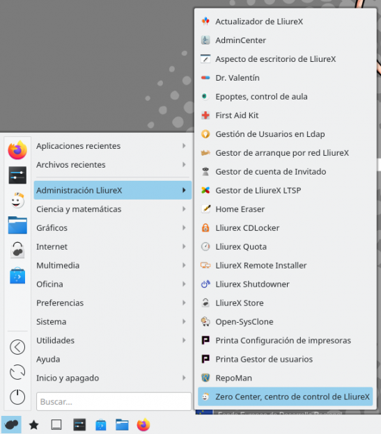
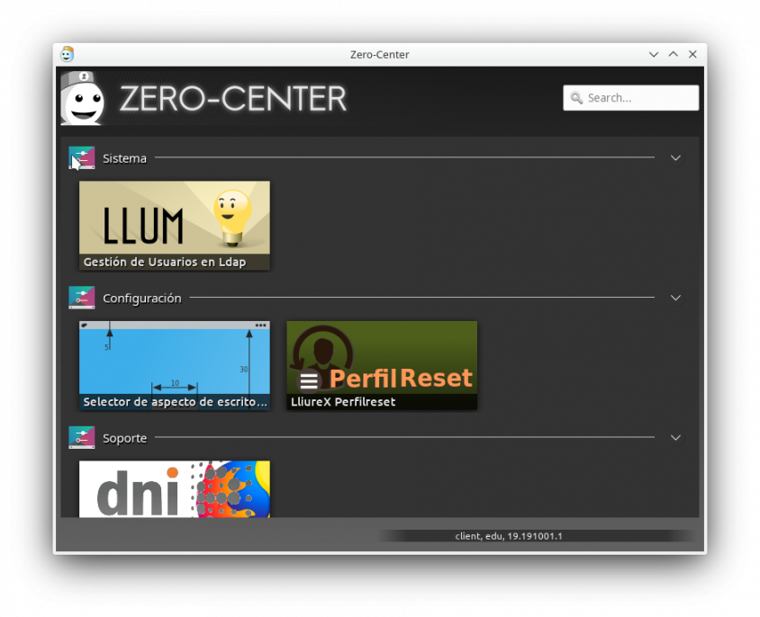
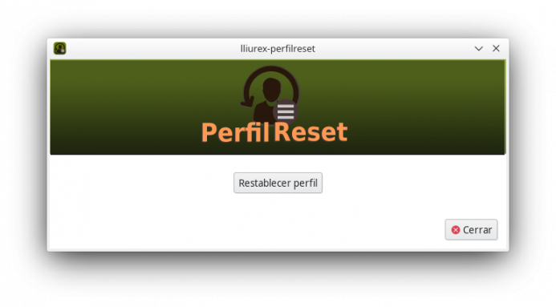

# Tema 4: Administrando Lliurex
## Introducción
En esta unidad veremos qué carpetas se sincronizan con el servidor así cómo actualizar/instalar/desinstalar los paquetes en Lliurex. Además, cuando un usuario cambia su layout de escritorio (desaparecen elementos como la barra de inicio, escritorio vacío...), veremos cómo resolverlo. Finalmente, ahondaremos en la resolución de conflictos o problemas que pudieran dar los clientes (o ordenadores escritorio).

## Carpetas que se sincronizan  con el servidor
La carpeta personal de un usuario de red está estructurada de la siguiente manera:
* Descargas
* Documentos
* Escritorio
* Compartido
* Compartido de grupos
* Datos de alumnos (sólo para cuentas del profesorado) 

Además de éstas, existen otras en las que se mantiene la configuración personal de algunos programas, temática de escritorio, etc. que también se sincronizan con el servidor gracias al programa Perfiles móviles.

Debemos tener en mente que las carpetas que se sincronizan con el servidor son la carpeta **Documentos** y la carpeta **Escritorio**.
### Compartido
Esta carpeta contiene ficheros compartidos para todo el aula. Sólo el profesorado y el administrador netadmin del aula tienen permisos de escritura en esta carpeta, mientras que el alumnado únicamente tiene permisos de lectura. 

### Compartido de grupos
Compartido de grupos es una carpeta similar a Compartido con la peculiaridad de que ésta está organizada por grupos, cada uno de los cuales tiene la suya propia. Así, por ejemplo, un alumno o alumna del grupo 3ESOA sólo podrá acceder a la carpeta 3ESOA. Al igual que Compartido, sólo el profesorado y el administrador del aula tienen permisos de escritura en este directorio.

### Datos alumno
La carpeta datos alumnos permite acceder a los ficheros contenidos en los directorios Documentos y Escritorio del alumnado del sistema.

### ¿Cuál es la ruta (path) dónde se encuentran estas carpetas de red?
Podemos hallar todas estas carpetas de red en el servidor en:
> /net/server-sync

## Reestablecer perfil
Los usuarios, tanto en los clientes como en el servidor pueden modificar su layout de escritorio, mover, añadir, eliminar elementos. Por ejemplo, lo más frecuente es que se elimine la barra de tareas, que integra el menú de aplicaciones. Entonces, ¿qué podemos hacer para que vuelva a aparecer o reestablecer los elementos por defecto.

La reestauración del perfil del usuario se debe ejecutar en el propio entorno del cliente, es decir, con la sesión iniciada. Para ello, podemos buscar dentro del **zero-center** el programa **LliureX-PerfilReset**.

Debemos hacer clic en Reestablecer perfil y esperar 60 segundos, aproximadamente. Tras reiniciar la sesión, el escritorio volverá a mostrar la configuración original por defecto.

 Si no se dispone de menú de aplicaciones, podemos lanzar el programa mediante línia de comandos. Para ello pulsamos:
> Control+ALT+T
Se nos abrirá el terminal y escribimos:
> lliurex-perfilreset

## Actualizar Lliurex

## Instalar paquetes

## Desinstalar paquetes

# Ver los procesos que hay en background
y que pueden causar conflictos e inconvenientes con el software instalado. Por ejemplo, hay software que una vez instalado ¡se desinstala solo!