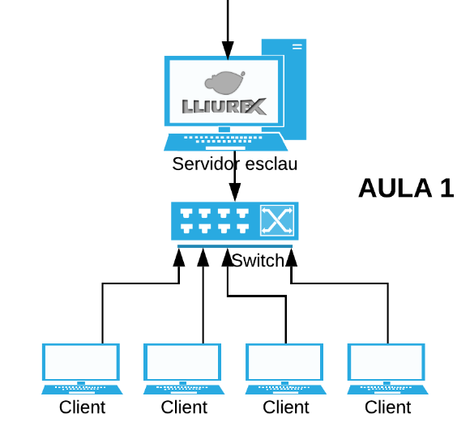
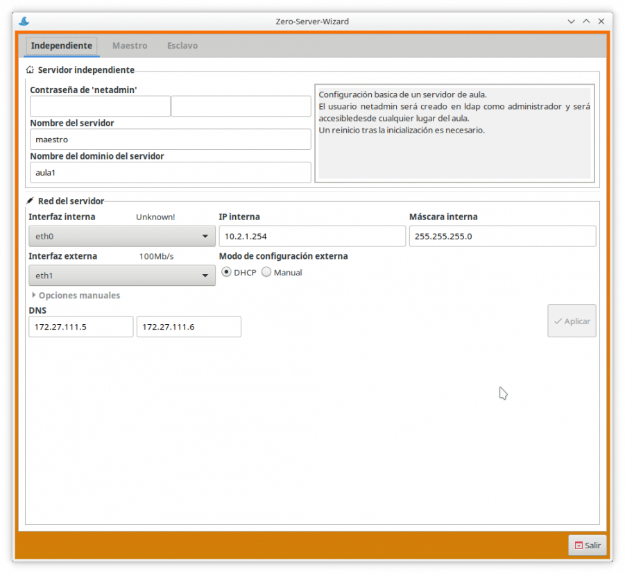
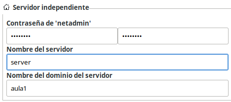
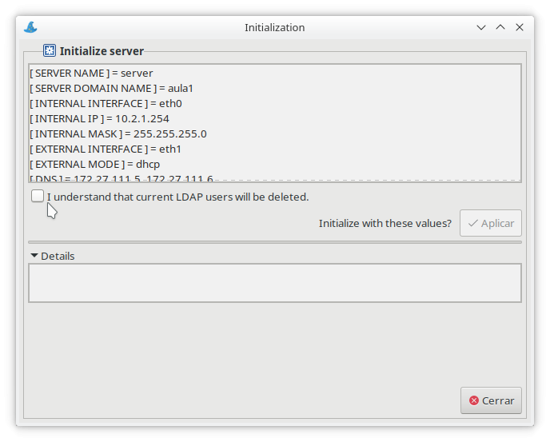
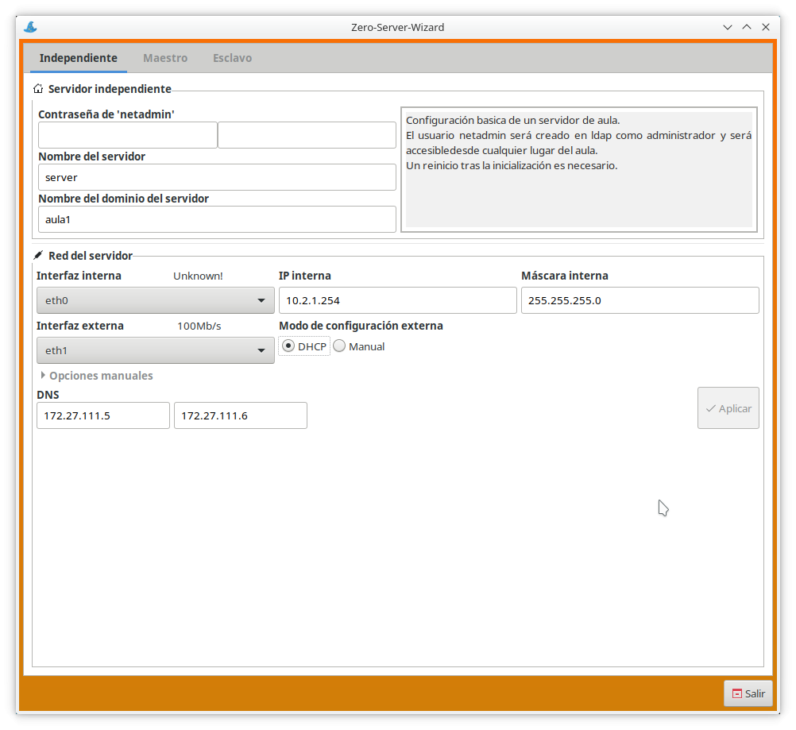
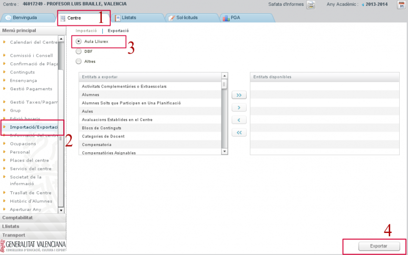
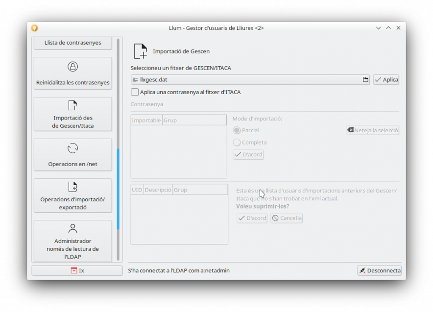
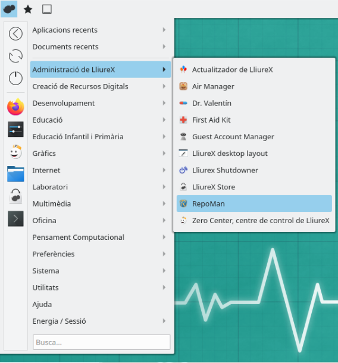
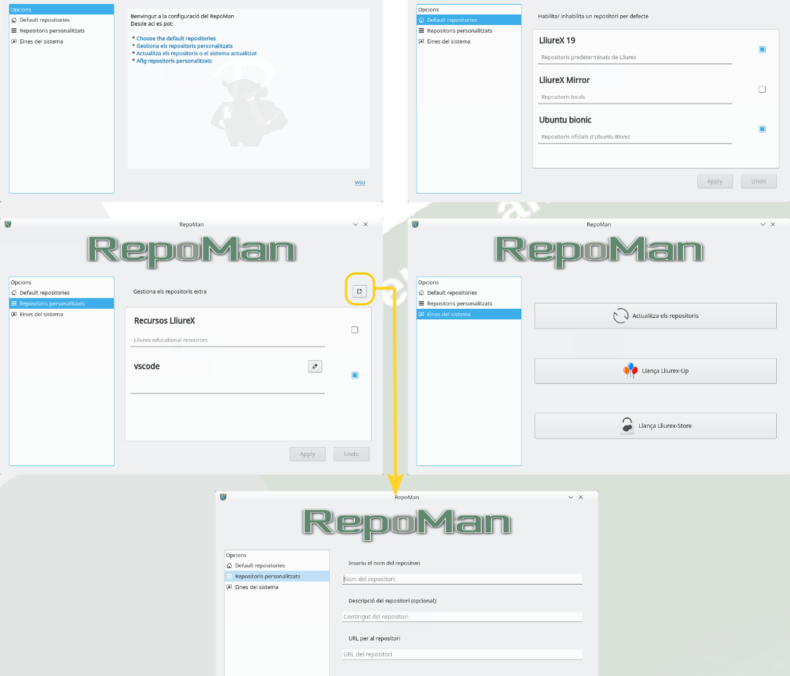

# Tema 5: Administrando el aula Lliurex
## Introducción
En esta unidad veremos cómo inicializar un servidor de aula Lliurex, aprenderemos a qué redes estamos conectados y con qué interfaz, conoceremos cómo instalar software de forma automática y remota, veremos cómo gestionar de forma todos los equipos de nuestra aula y, finalmente, indagaremos en la herramienta para la gestión de los repositorios.

## Conceptos iniciales
Una vez instalado el modelo de aula o de centro, que se explica en el [Tema 7](tema7), debemos centrarnos en nuestro "terreno", es decir, en el segmento de red que podemos administrar, que es nuestra aula. A continuación se muestra un diagrama dónde podemos visualizar el diagrama físico.

Cómo podemos observar, al servidor se le conecta a la red del centro, ya sea con IP 172.X.X.X o mediante una IP privada 10.X.X.X.
Solo con este dato, ya podemos saber a ciencia cierta si nuestro servidor de aula es **independiente**, **maestro** o **esclavo**. La otra interfaz, se conecta con la red de aula, y suele tener esta apariencia 10.2.1.254.

## Tipos de servidor
En el modelo de aula o centro existen tres tipos de servidor:

| Servidor         | Características |
|:--------------|:-----|
|Independiente | El servidor trabaja de manera independiente |
|Maestro | Proporciona servicios a los esclavos |
|Esclavo | Puede trabajar de manera independiente, sincroniza con MASTER (Maestro) |

El servidor tiene como mínimo 2 tarjetas de red:
* La red interna: a esta tarjeta se conectará uno switch donde se conectarán los clientes.
* La red externa: se conectará directamente en la red de Aulas del router (antigua macrolan).
* 
Para que el servidor funcione dentro del modelo de aula/centro hay que configurarlo e inicializarlo con el *zero-server-wizard* que veremos más adelante.

## Esquema de red
Hemos de tener en cuenta los siguiente elementos. Cada uno de los servidores tiene que tener como mínimo 2c tarjetas de red:
| Tarjeta         | Características |
|:--------------|:-----|
|eth1 | Tarjeta externa que se conecta en la red de Aulas: espacio de direcciones IP = 10.2.1.254/24 |
|eth0 | Tarjeta interna que da DHCP en el aula |
|eth1 | Tarjeta externa que se conecta en la red de Aulas |

## Inicialización del servidor de aula
Para poder tener el modelo de aula es importante inicializar el servidor. El servidor se puede inicializar de tres maneras diferentes. Para este supuesto, solo queremos un servidor de aula, el servidor se inicializa como independiente.
Para poder inicializar el servidor haremos uso del programa zero-server-wizard. Podemos iniciarlo desde la terminal con:
> zero-server-wizard

También podemos acceder desde Menú de aplicaciones > Administración LliureX > Zero-Center, centro de control de LliureX.

En nuestro caso, vamos a iniciar este servidor como independiente. Hay que tener mucho cuidado en identificar la tarjeta externa (la que ha cogido una IP del Router), la tarjeta interna (la que se comunica con los ordenadores clientes del aula).

En el campo netadmin se requiere que escriba por duplicado la clave de administrador de red. Esta clave no tiene por qué coincidir con la clave del administrador del sistema, puede ser diferente. Se recomienda que para realizar tareas de administración del aula se utilice el usuario netadmin una vez finalizada la inicialización del servidor. Si al introducir la clave por duplicado no coincidieran ambas claves, el sistema avisa marcando la segunda en rojo.

Con respecto a la interfaz externa de red, eth1, se recomienda configurarla de forma manual con el rango de direcciones IP que tenga asignado el centro.

Como convenio se suele dejar la dirección más alta. En este ejemplo, sería la 172.27.104.254 para el servidor de centro e ir cogiendo de forma decreciente las sucesivas para las aulas de informática. En este ejemplo serían la 172.27.104.253 para el aula 1, la 172.27.104.252 para el aula2, etc.

Con respecto la puerta de enlace, se suele coger la primera dirección en este ejemplo la 172.27.104.1.

Si los DNS están en macrolan, se configurarán automáticamente con 172.27.111.5 y 172.27.111.6. En caso de no estar en macrolan, podemos coger los típicos de Google (8.8.8.8 y 8.8.4.4) o los que consideremos.

Para continuar con el proceso, pulsamos el botón Aplicar.

Seguidamente, se muestra una pantalla donde se resumen todas las opciones que ha configurado. Pulsamos el botón Aplicar (ver cuadro resaltado en azul en la zona mitad-derecha de la ventana).

Una vez configurado, se nos pide que reiniciemos la máquina para que la configuración se aplique correctamente. 

## Inicialización de usuarios LDAP
Si queremos importar los usuarios de ITACA, el primer paso que debemos hacer es el de exportar el fichero en ITACA. Para ello podemos seguir los siguientes pasos:
* Dirigirnos a la pestaña Centro
* Seleccionar, en el menú de la izquierda, la entrada Importación/Exportación
* En la parte central, dejar seleccionada la opción Aula LliureX
* Pulsar el botón Exportar y seleccionar la carpeta destino

Con este fichero, accedemos al **llum** en la máquina donde queremos hacer la importación y vamos a Operaciones de Exportación/Importación. Buscamos el archivo que queremos importar y le damos a importar.

Mediante la herramienta **llum**, podemos gestionar usuarios y roles, así como limpiar todos los */home* de los usuarios. Esto solo elimina los directorios en el servidor.

[Más información.](https://wiki.edu.gva.es/lliurex/tiki-index.php?page=Gesti%C3%B3n+de+usuarios#Gesti_n_de_usuarios)

## Instalación remota de software
Instalación de software tanto en el servidor como en los clientes sin necesidad de hacer uso de Zero Center y sin que estas acciones interfieran con lo previamente instalado.

## Gestión remota de los clientes

## Gestión de repositorios
Finalmente, vamos a ver la herramienta Repoman (Repository Manager). Esta no es una herramienta para instalar paquetes, sino para gestionar los diferentes repositorios o depósitos de software configurados a nuestro ordenador. En nuestro sistema, podemos tener tantos repositorios configurados cómo deseamos. De manera predeterminada, en LliureX solo tendremos configurados los depósitos de software de LliureX, pero podemos configurar todos los que deseamos.

Para acceder a la herramienta, lo hacemos a través del menú de Inicio > Administración de LliureX > RepoMan, o directamente buscándolo en la barra de busca del menú de inicio.

La primera pantalla que nos muestra la herramienta es la de Opciones, con enlaces a las diferentes secciones, las cuales también se nos muestran al cuadro de la izquierda. Las diferentes opciones disponibles que tenemos son:
* Gestionar los repositorios por defecto, donde podremos:
    * Activar o desactivar los repositorios de LliureX desde Internet (de manera predeterminada en la versión de escritorio están activados)
    * Activar o desactivar los repositorios de LliureX desde uno Mirror o Réplica del centro. Si trabajamos en un modelo de centro y disponemos de una réplica de los repositorios de LliureX al servidor, esta sería la opción más adecuada.
    * Activar o desactivar los repositorios de Ubuntu. De manera predeterminada están desactivados, y podemos activarlos si necesitamos software de Ubuntu que no esté en LliureX. En caso de que un paquete esté tanto en los repositorios de Ubuntu como a los de LliureX, tendrá preferencia lo del repositorio de LliureX, aunque haya una versión más actualizada en Ubuntu.
* Gestionar repositorios personalizados, donde podremos configurar otros repositorios externos en LliureX y en Ubuntu. Para añadir un nuevo repositorio haremos clic en el botón que hay encima del recuadro de los repositorios, y añadimos su dirección web, junto con el nombre y una descripción.
* Herramientas del sistema, desde donde podremos actualizar las listas de software, lanzar el actualizador LliureX Up o LliureX Store.

