# Tema 6: Proxmox
## Introducción
En esta unidad vamos a ver la instalación de Proxmox así como crear nuestra primera máquina virtual.

## Instalación
Una vez descargada la ISO y grabada en un USB, iniciamos con el USB.

Todos sabemos que es importante leerse la licencia :)

Esta es una de las partes más delicadas y depende de lo que queréis tener montado en vuestro centro, también depende de la cantidad de discos duros que tengáis instalados y de si queréis invertir dinero en una cabina de discos duros.

Si queréis dejarlo en ext4. Y utilizar un único disco para utilizar Proxmox en las máquinas virtuales, no va a dar malos resultados. El otro disco duro lo podéis utilizar para hacer copias de seguridad.

Proxmox utiliza ZFS que es una combinación de administrador de volúmenes y sistema de ficheros.

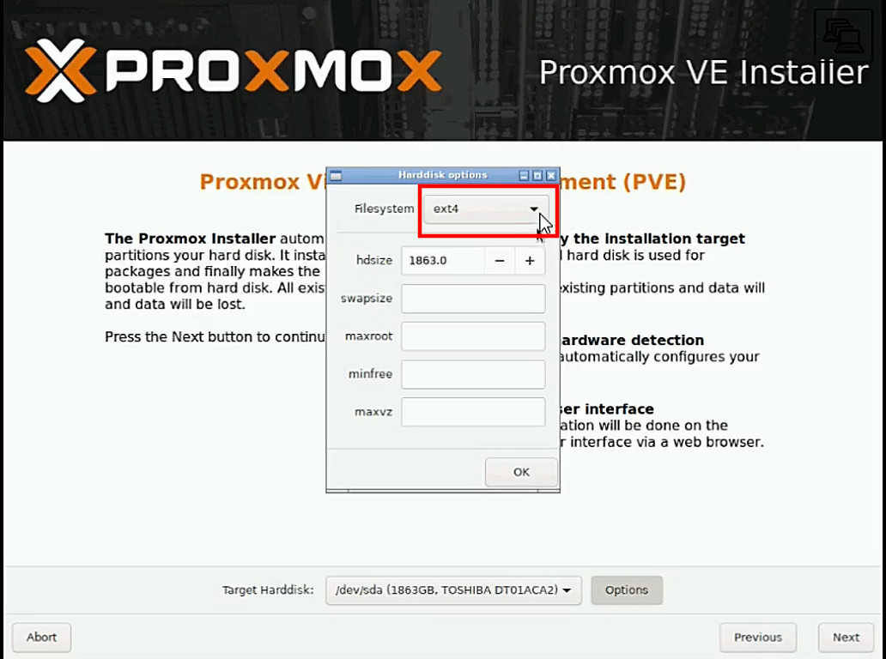

Las opciones que tenemos son las siguientes:

| Sistema         | Características |
|:--------------|:-----|
|RAID0 	|Suma capacidades de los discos. Si falla una unidad es inservible.|
|RAID1 	|Dato escrito idénticamente. Mínimo 2 discos de la misma medida.|
|RAID10 |	Una combinación de RAID0 y RAID1. Mínimo 4 discos.|
|RAIDZ-1 |	Variación de RAID-5, paridad sola. Mínimo 3 discos.|
|RAIDZ-2 |	Variación de RAID-5, paridad doble. Mínimo 4 discos.|
|RAIDZ-3 |	Variación encima RAID-5, paridad triple. Mínimo 5 discos|

Si habéis optado por adquirir una tarjeta controladora para montar un RAID, esta opción no la tenéis que usar. Siempre y cuando la tarjeta sea reconocida por Proxmox, se verá como un único disco. Las opciones que estamos configurando es RAID por vía software.

La opción más nivelada entre todos los parámetros a tener en cuenta sería la opción de RAID1.

Configuramos la zona geográfica.

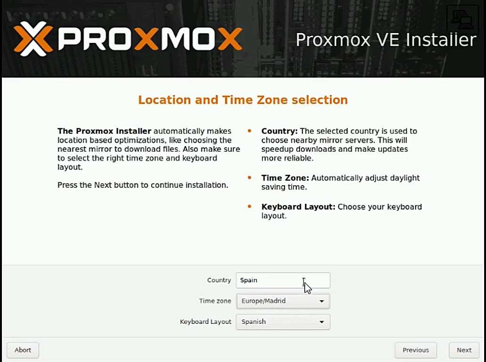

Configuramos el password y la contraseña.

Configura la red según los parámetros de tu centro. El ejemplo dado no es el correspondiente al que deberías de utilizar.

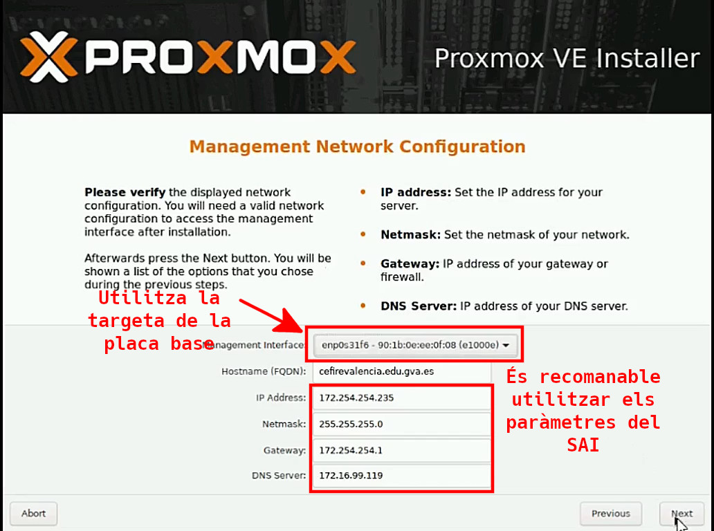

Comprobamos que todos los parámetros que hemos configurado son los correctos y le damos a Install. Enseguida empezará la instalación que suele ser bastante rápida.

Una vez finalizada la instalación. Reiniciamos el sistema y pasaremos a la siguiente unidad. Configuración del Proxmox.

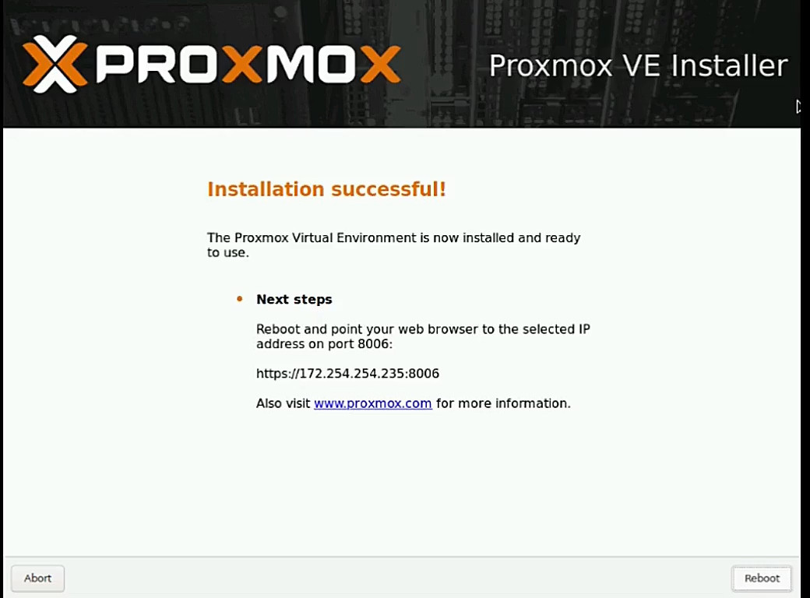

## Configuración
Una vez tenemos instalado PROXMOX y haya reiniciado, podremos acceder en él. Toda la configuración del PROXMOX se realiza a través de un servidor web que lleva el sistema. Para acceder tenemos que hacerlo a través del puerto 8006 con certificación ssl. Sencillamente escribimos en un navegador de una estación de trabajo que esté en la misma red lo siguiente:

> https://"IP_HIPERVISOR:8006

Este es uno de los motivos por los cuales dejamos puertos en cada switch con la VLAN 1, para poder acceder a través de esos puertos siempre al PROXMOX. También se puede hacer desde cualquier ordenador del centro o el aula de informática, pero hay que habilitar el NAT en cada servidor LliureX. Y estos tienen que estar funcionando. Por lo tanto es necesario estar conectado en la red del centro.

### Máquinas virtuales

Lo primero que nos pide es el usuario y contraseña que hemos configurado cuando hemos hecho la instalación:
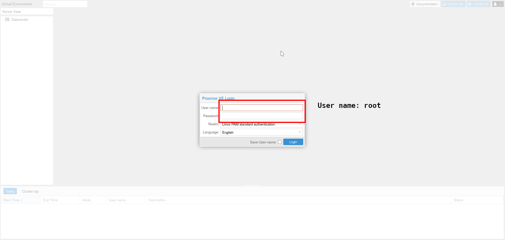

Y una vez dentro podemos ver el espacio de trabajo del PROXMOX:
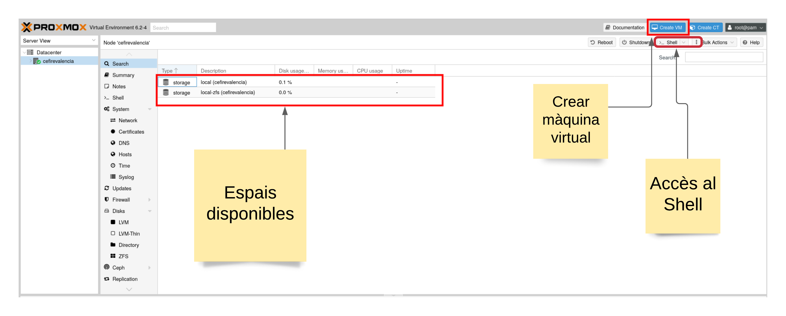

Los siguientes pasos son opcionales, pero aconsejables. Es para acceder a las últimas actualizaciones de PROXMOX.

Una vez hemos accedido podemos configurar la lista de los repositorios de PROXMOX accediendo, en primer lugar al shell del hipervisor y escribimos lo siguiente:

> nano /etc/apt/sources.list.d/pve-enterprise.list

Ten en cuenta que has accedido como root, así que tienes que ir con mucho cuidado con lo que haces. Una vez abres el fichero cambias el repositorio por el siguiente:

> deb http://download.proxmox.com/debian/pve buster pve-no-subscription

Se quedaría así:
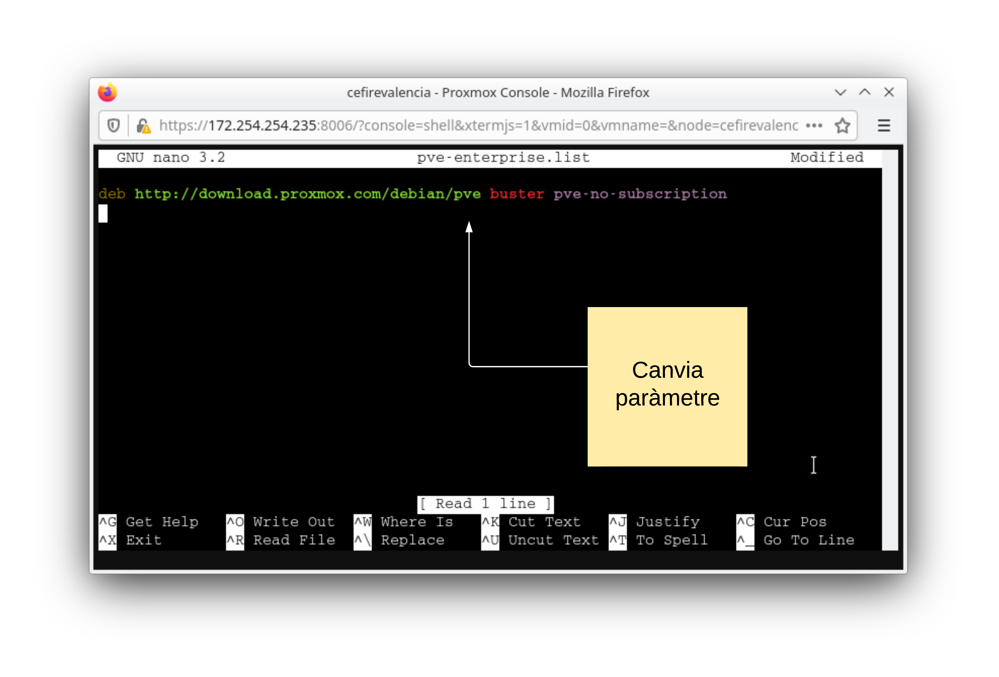

Ahora ya puedes actualizar desde la terminal el PROXMOX para tener la última versión:

> apt update
> 
> apt upgrade

### Crear máquina virtual

Antes de crear una máquina virtual tenemos que subir la iso de LliureX Server, podemos descargarla de aquí. Tratamos de buscar la última versión editada.

Una vez ya tenemos la descarga es necesario subirla al PROXMOX, lo hacemos seleccionando el espacio local y haciendo click en upload:
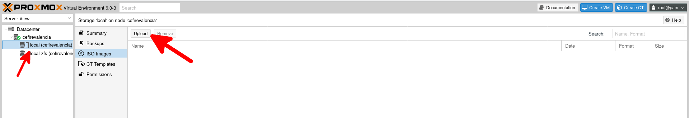

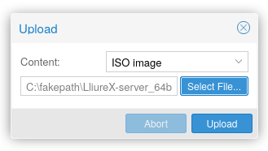

Una vez tenemos hecho esto, ya podemos crear la primera maquina virtual. Haremos de ejemplo el servidor MASTER y los otros se hacen de manera similar. Hagamos click sobre Create VM.
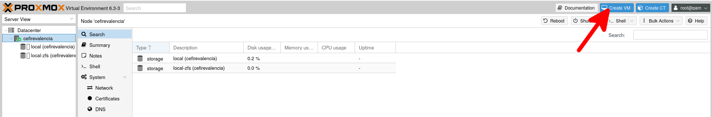

Se abrirá una ventana para especificar los parámetros de configuración. En la primera ventana no hay que cambiar nada, vamos a Next:
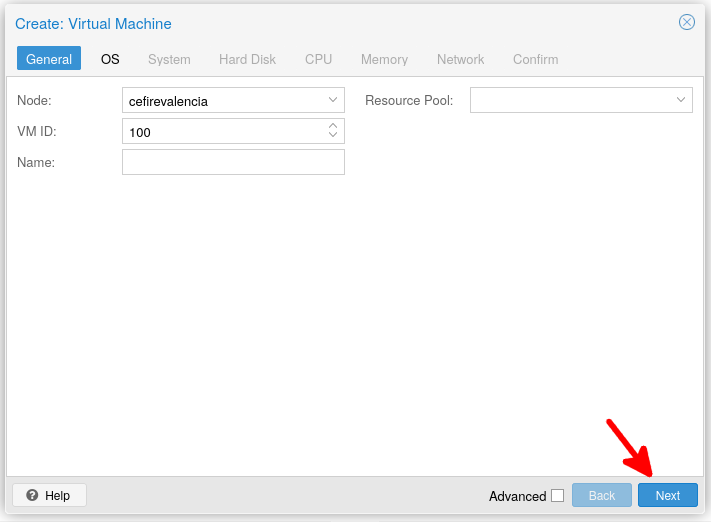

En este punto tenemos que seleccionar la iso que acabamos de subir:
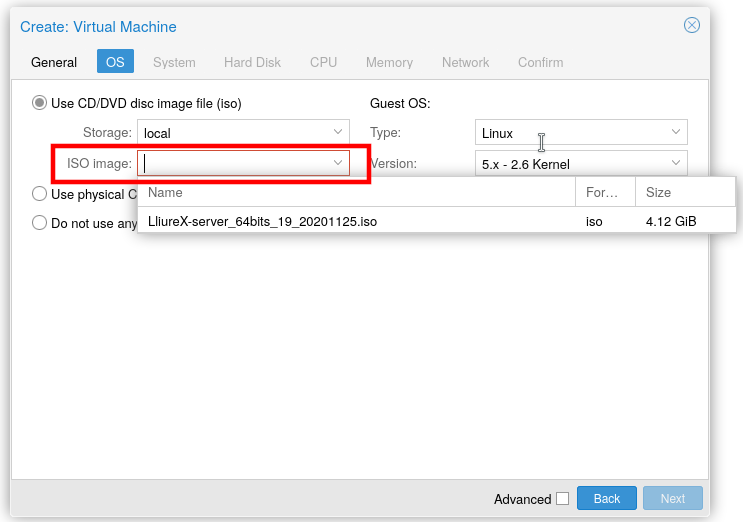

Posteriormente damos a next:
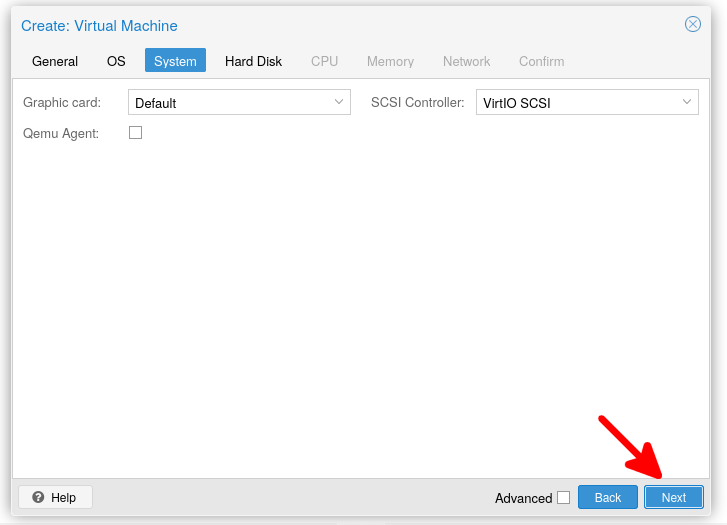

Escogemos el disco a utilizar, y opcionalmente cambiamos la cache a write back.

Write-back puede dar un poco más de rendimiento al disco pero es más propenso a perder datos si hay un corte. Queda a criterio de cada cual escoger.

Dependiendo del tamaño del centro el disco del servidor lliurex MAESTRO necesitará más espacio. Es aconsejable añadir un disco grande como por ejemplo un 1TB o más ya que almacenará los datos de todo el alumnado, profesorado, mirror, clientes ligeros, clonaciones, etc. En los servidores ESCLAVOS no es necesario tanto espacio (150GB por ejemplo) ya que montan /net del MAESTRO.
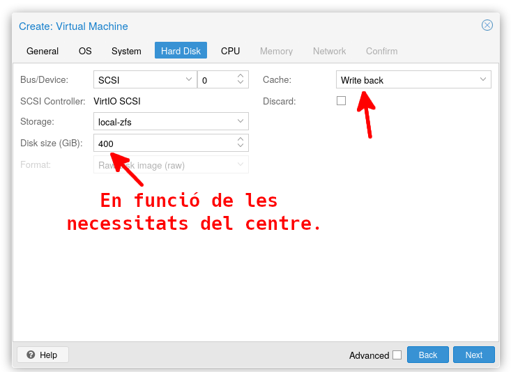

Cambiamos los parámetros de la CPU, en principio 4 cores en total es suficiente para las tareas a realizar.
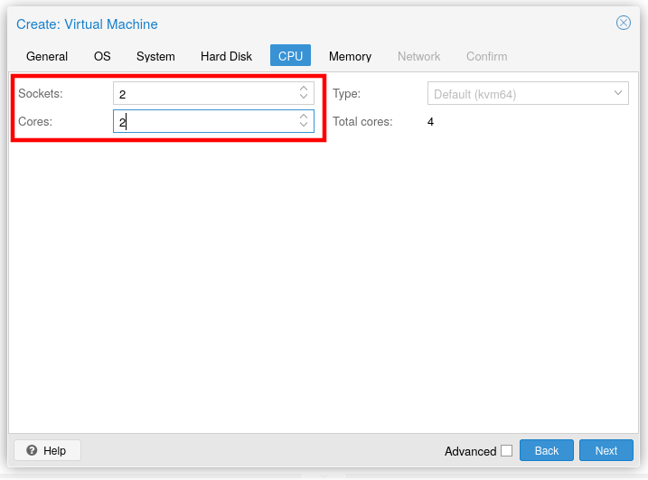

Damos 6Gb de memoria RAM. Este parámetro irá siempre en función de la cantidad de máquinas que vayamos a tener.

La suma de la memoria RAM de todas las máquinas puede ser sin problemas mayor que la cantidad de memoria RAM disponible. Eso sí, si todas las máquinas empiezan a pedir mucha memoria, el sistema se puede volver muy lento o colapsar. Así que no es recomendable.
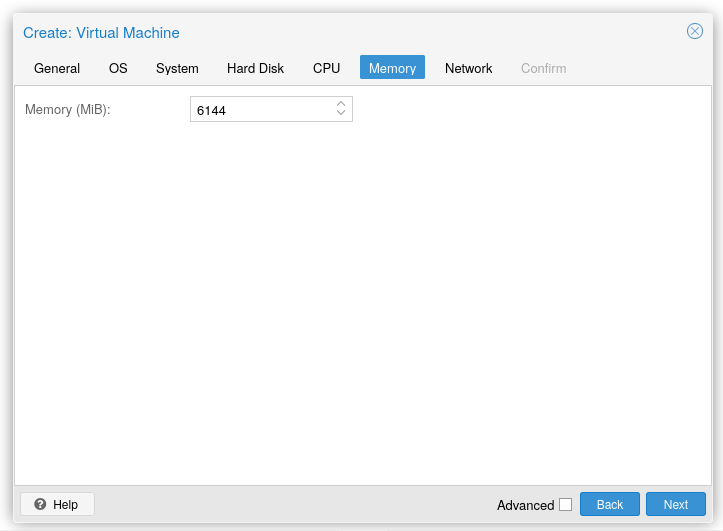

Finalmente, no cambiamos nada a los parámetro de red y una vez instalada la máquina ya añadiremos las tarjetas virtuales.
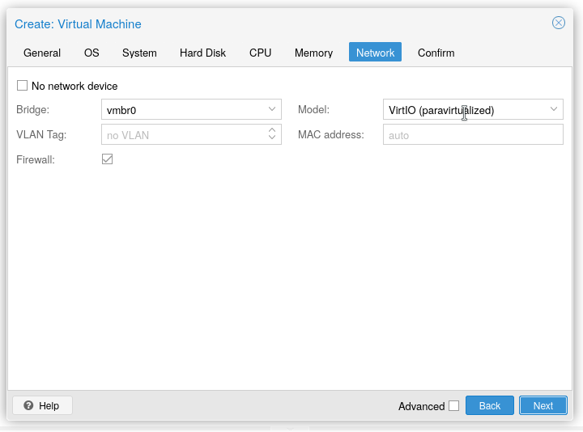

Podemos activar el checkbox de Start after created para poder iniciar la máquina una vez le damos a Finish.
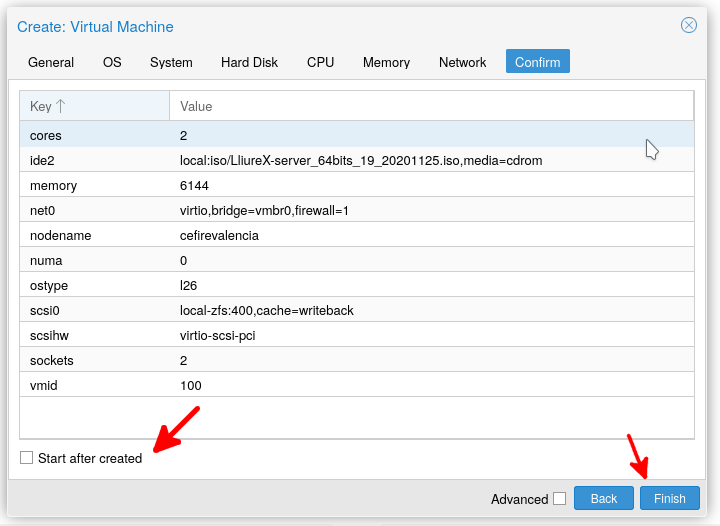

### Instalación de la máquina virtual

Una vez configurada la máquina virtual y haya arrancado podemos ver como nos aparece un icono en la franja izquierda y se pone de color, podemos desplegar el menú contextual y pulsar sobre Console:
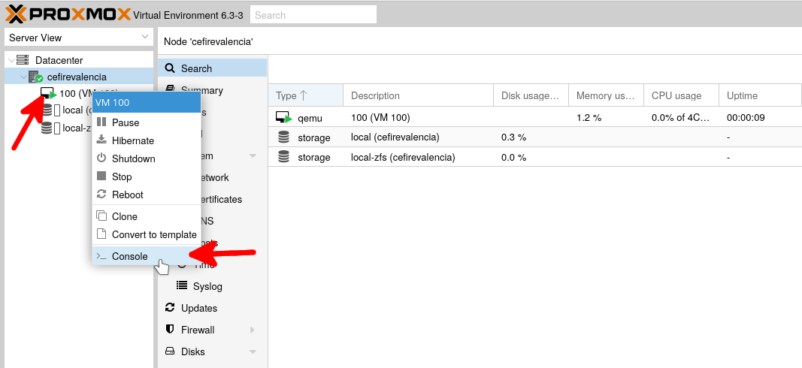

Podemos ver cómo ha arrancado la máquina:
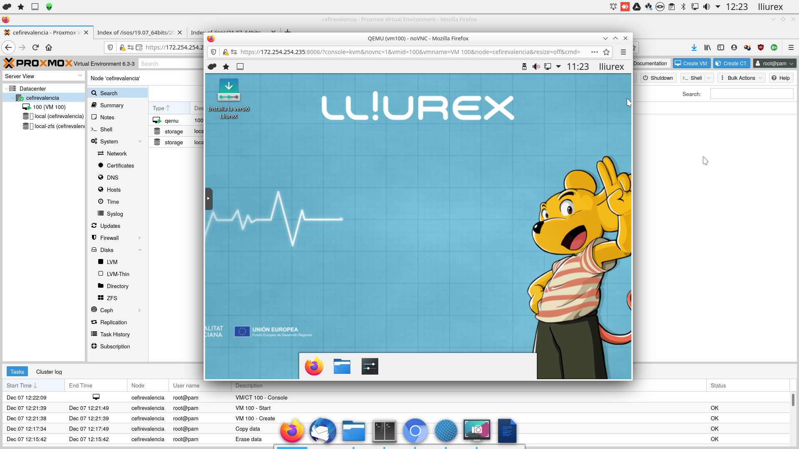

## Funcionamiento
¿Cómo combinar la complejidad y la variedad del software de los ciclos formativos de la tarde con la sencillez y la estabilidad de las clases de informática en ESO y Bachillerato? ¿Cómo utilizar servicios pesados en las aulas informáticas? Tenemos el problema de que los ciclos formativos requieren de gran variedad de servicios como diversos servidores web, diversos servidores de BD, diversos entornos de desarrollo, etc. Se instala y se desinstala mucho. Si instalamos directamente en el servidor corremos el riesgo de que haya problemas en el aula y si se usan máquinas virtuales el rendimiento es muy bajo porque tanto el servidor como los clientes no son potentes. ¿Alguna sugerencia? ¿Cómo lo hacen en otros centros?