# Tema 7: Modelo de centro

## Introducción
En esta Unidad configuraremos el hipervisor con PROXMOX. Montaremos 3 servidores con las siguientes características.

|Servidor | Características|
|:--------------|:-----|
|MASTER | Tendrá el LDAP y guarda el /net|
|CENTRO | DHCP a los ordenadores del centro|
|AULA1 | DHCP a los ordenadores del aula de informática|
|WIFI |No montaremos el servidor WIFI en esta unidad|

Daremos como ejemplo dos esquemas de montaje de centro. Los dos son totalmente válidos pero nos centraremos en el primero en este curso ya que el segundo ejemplo es para instalaciones que no tienen switches gestionables.

### Esquema 1
En este esquema tenemos como ejemplo el switch principal del centro con 1 LAG de 4 puertos conectado a las cuatro tarjetas de red del servidor. También conectamos la tarjeta de red de la placa base del servidor a una boca del switch.
El esquema sería de la siguiente manera:

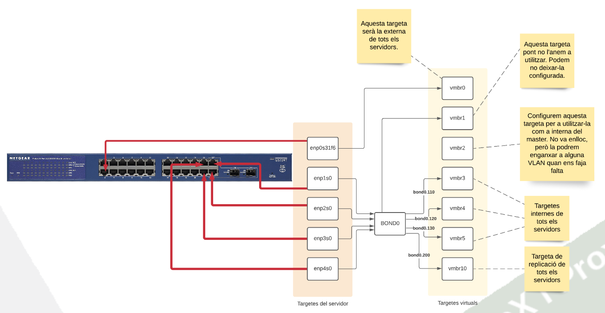

### Esquema 2
En el siguiente esquema no se usan switches gestionables por lo que no se usan VLANs. Cada tarjeta del hipervisor va a un switch diferente. Este esquema no aprovecha las ventajas que tiene un LAG (aumento ancho de banda y tolerancia a fallos). Este montaje se utiliza principalmente en centros pequeños. El equema sería de la siguiente manera:

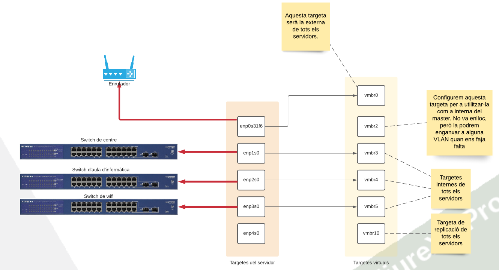

### Clúster
En este tema vamos a configurar un solo hipervisor pero si tenemos más hipervisores habría que crear más LAGs en el switch y la misma configuración de PROXMOX en todos los hipervisores. Una vez estuviera todo conectado, configurado y en marcha se pueden unir los servidores PROXMOX en un clúster. El clúster permite gestionar todos los servidores PROXMOX de forma unificada, mover VM de un PROXMOX a otro y más cosas.

### Alta disponibilidad
Una vez hemos creado un clúster podemos mejorarlo con la alta disponibilidad. La alta disponibilidad (HA) permite que cuando un hipervisor se estropea los otros cogen de forma automática las máquinas virtuales del mismo y siguen dando servicio sin que el usuario lo note. Esto permite cambiar el hipervisor o arreglarlo y el servicio no es interrumpido en ningún momento. Para hacer esto es necesario montar un CEPH o tener una cabina/NAS de discos externa con mucha fiabilidad (y muy caras). En estas cabinas es donde se guardan los discos de todas las VM y ya no estarían almacenados en los discos de los servidores PROXMOX. Esta configuración no se va a tratar en este curso.

### Esquema de máquinas virtuales (VM)
En ambos esquemas la configuración de las máquinas virtuales es igual ya que la configuración de donde se conectan las tarjetas virtuales se hace desde el PROXMOX. Hemos respetado los nombres de las tarjetas en ambos casos (vmbrX), pero se puede dar el nombre que quieras.

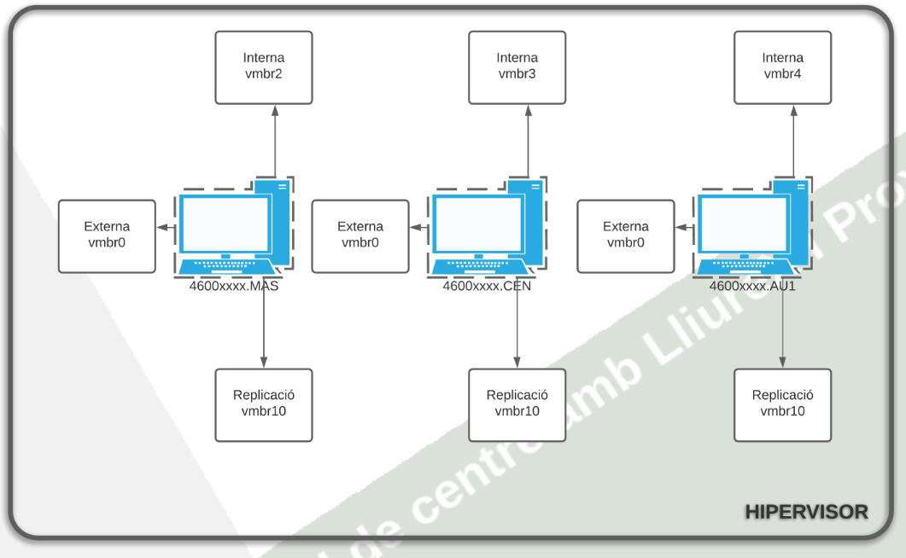

## Configuración del PROXMOX
Una vez tenemos instalado PROXMOX y haya reiniciado, podremos acceder en él. Toda la configuración del PROXMOX se realiza a través de un servidor web que lleva el sistema. Para acceder tenemos que hacerlo a través del puerto 8006 con certificación ssl. Sencillamente escribimos en un navegador de una estación de trabajo que esté en la misma red lo siguiente:

> https://"IP_HIPERVISOR:8006

### Máquinas virtuales

De manera similar similar al tema anterior, si queremos seguir todo el proceso habría que instalar los otros dos servidores ESCLAVOS con el mismo procedimiento. Lo único que hay que cambiar entre ellos sería el nombre de cada uno de ellos y el tamaño del disco, nosotros hemos escogido la siguiente nomenclatura:

|Nombre | Servidor|
|:--------------|:-----|
|4600xxxx.MAS | Servidor Master| 
|4600xxxx.CEN | Servidor de centro|
|4600xxxx.AU1 | Servidor Aula informática|

Y para el administrador de cada uno de los servidores hemos escogido admin0.

## Configuración de la red
Una vez tenemos instalados todos los servidores procedemos a configurar la red. Para acceder a la configuración del hipervisor tenemos que seleccionar el icono del hipervisor (no la máquina virtual ni el Datacenter), y vamos a las opciones Network.

### Esquema 1
Recordemos que este esquema tiene un bond al switch. Pulsamos sobre Create y seleccionamos la opción Linux Bond.

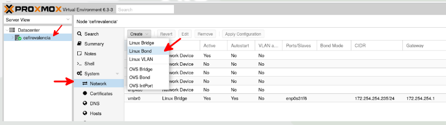

Se nos abrirá la ventana siguiente y tenemos que escribir todas las tarjetas donde pone Slaves, seguidas de un espacio. La configuración quedaría de las siguiente manera:

|Parámetro |Opción|
|:--------------|:-----|
|Slaves |enp1s0 enp2s0 enp3s0 enp4s0|
|Modo |LACP|
|hash-policy |layer2+3|

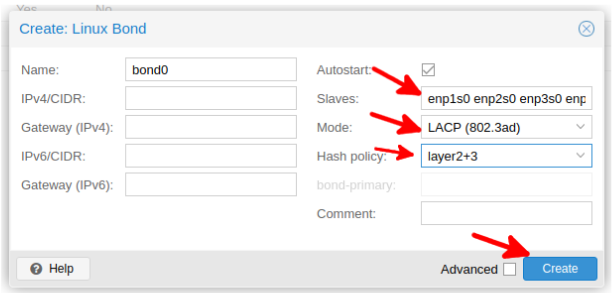

Una vez tenemos configurado el bond pulsamos otra vez a Create y seleccionamos Linux Bridge. En la opción Bridge ports tenemos que escribir el bond0 seguido de un punto y el número de VLAN que queremos configurar a la conexión puente.

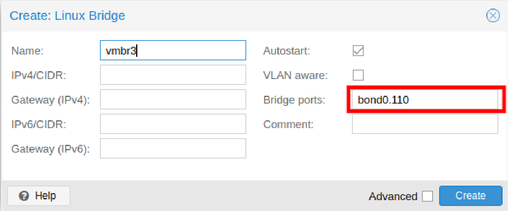

De manera análoga realizamos todas las otras configuraciones y nos quedaría de la siguiente manera:

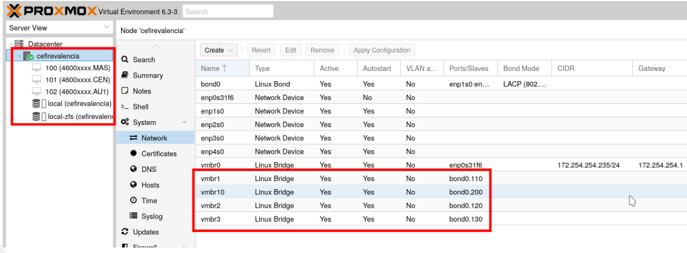

### Esquema 2
Este esquema que no presenta ninguna VLAN se haría de manera análoga al anterior, pero sin configurar el bond. Cogeríamos cada tarjeta virtual Linux bridge y la enlazamos a la tarjeta de salida. El esquema quedaría de la siguiente manera:

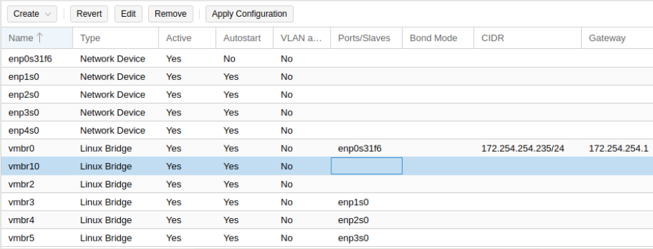

## Configuración de la red en cada MV

Tenemos que recordar que cada servidor LliureX debe tener 3 tarjetas:

|Tarjeta | Características|
|:--------------|:-----|
|Tarjeta externa |Es la que se conectará en la red de Aulas|
|Tarjeta interna |Conectada a los ordenadores del aula o las clases|
|Tarjeta de replicación |Para montar el /net entre los servidores|

En nuestro caso recordamos que las tenemos configuradas de la siguiente manera:

|Parámetro |Opción|
|:--------------|:-----|
|Tarjeta externa |vmbr0|
|Tarjeta interna |vmbr2, vmbr3, vmbr4, vmbr5|
|Tarjeta de replicación |vmbr10|

Para configurar cada máquina virtual seleccionamos la máquina y vamos a las opciones de Hardware, hacemos click sobre Add y escogemos Network device.

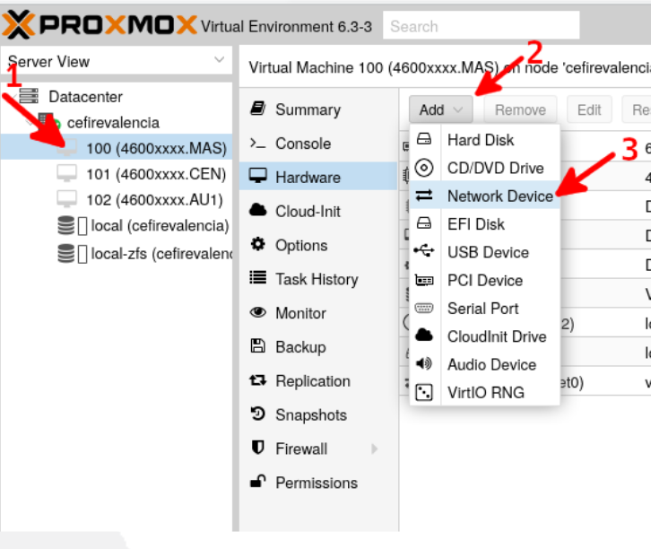

Como cuando hemos instalado la máquina virtual ya nos ha cogido la vmbr0, esa la dejamos como la externa. Y configuramos ya la interna.

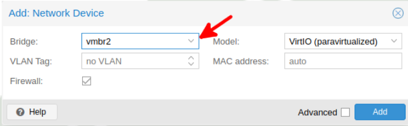

Este procedimiento lo tenemos que repetir en todos los servidores. Recuerda que el esquema de red es el siguiente:

|IP |Servidor|
|:--------------|:-----|
|172.X.Y.254 |Servidor Maestro|
|172.X.Y.253 |Servidor de Centro|
|172.X.Y.252 |Servidor de Aula 1|
|172.X.Y.251 |Servidor de Aula 2|
|172.X.Y.250 |Servidor de Aula 3|

### Tarjetas virtuales
Es importante que nos aseguremos antes de inicializar el servidor qué tarjeta es cual, es importante no confundirse. El servidor podría empezar a dar DHCP a través de tarjeta conectada a la VLAN1 o router (dependiente del esquema) y podría dejar sin servicio a todo el centro.
Podemos comprobar cuál es cada tarjeta con el comando ip en al servidor y comparar las MAC.

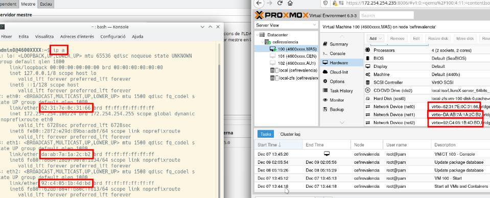

### Inicialización servidores
Cuando iniciamos el servidor, en este caso el MÁSTER, escogemos las siguientes opciones:

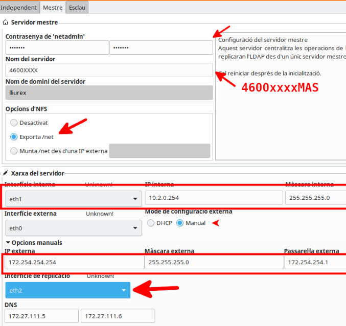

Es muy importante que habilites la opción de exportar el /net al servidor maestro. Un procedimiento extra que no nos tiene que olvidar en ningún servidor es actualizarlos siempre antes de hacer nada. Y en el MÁSTER tenemos que configurar el lliurex mirror.

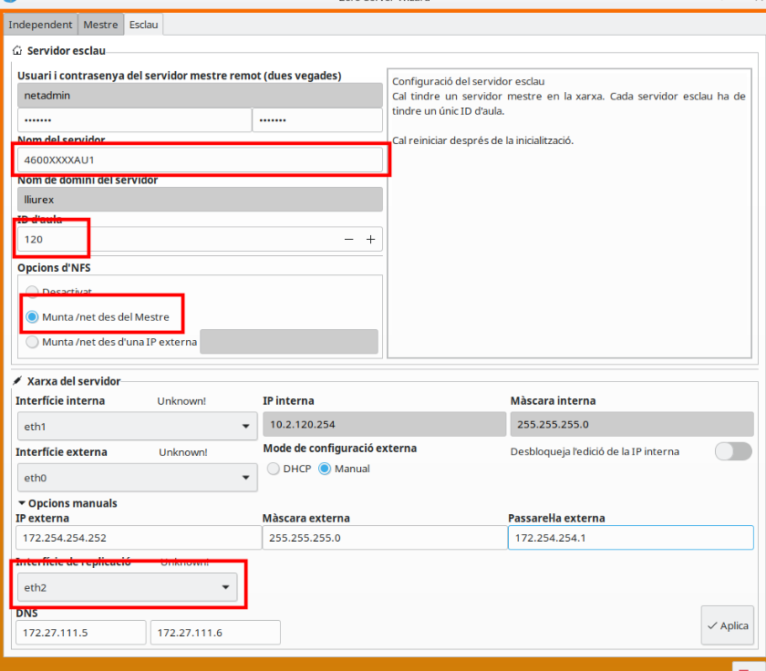

Es muy importante que habilites la opción monta el /net desde el maestro.

## Bibliografía
Curso Montaje y configuración del modelo de centro con LliureX y Proxmox del Cefire. Alfredo Rafael Vicente Boix y Javier Estellés Dasi.
Revisado por Sergio Balaguer

