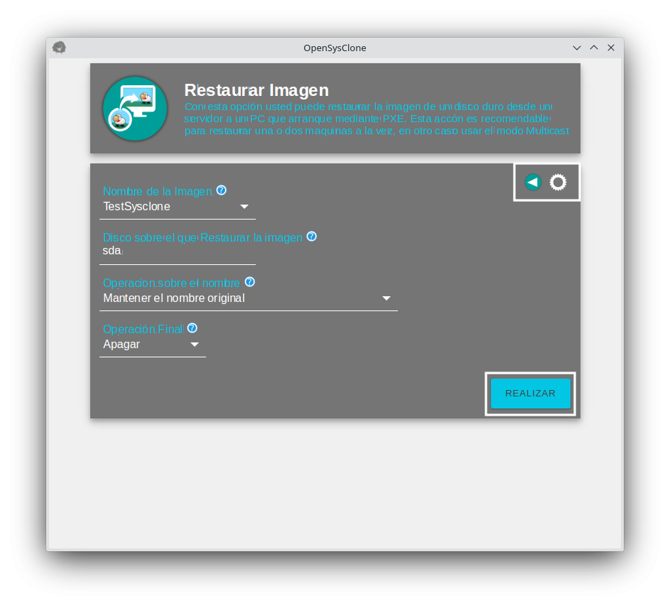
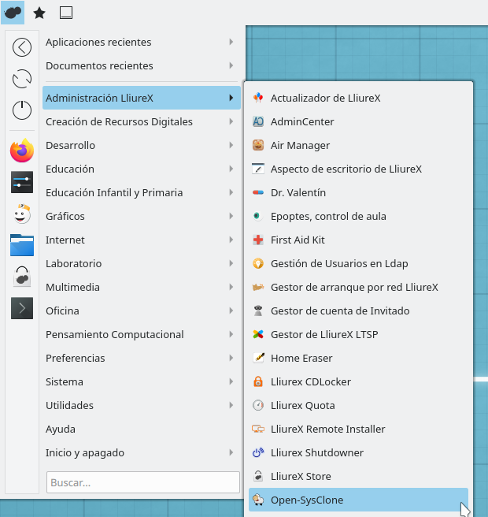

# Tema 8: Open-SysClone

## Introducción
Open-SysClone es la herramienta que, dentro de un aula, nos permitirá clonar las máquinas de una manera eficaz y precisa, obteniendo el máximo rendimiento de la red y optimizando el tiempo de preparación de las clases. Con ella seremos capaces de realizar una imagen de una máquina en un momento dado y restaurarla cuando, como y cuantas veces sea preciso sobre una o varias máquinas a la vez.

De esta manera solo tendremos que centrarnos en preparar un equipo con el software necesario y exportar al resto del aula, trabajando sobre él sin temor a desconfigurarlo ya que podremos devolverlo a su estado inicial, restaurándolo, en cuestión de pocos minutos.

 
### Preliminares

En un principio todo viene instalado por defecto en los servidores de LliureX, por lo que podemos acceder a la aplicación a través del menú: Aplicaciones -> Administración LliureX -> Open-SysClone.

El control sobre Open-SysClone se puede realizar, en este caso, sobre el propio servidor de aula o bien desde otro equipo (por ejemplo el equipo del profesorado) que esté dentro de la red del aula o tenga el servidor accesible desde la red del centro, mediante el paquete opensysclone-gui.

 
## Operaciones
### Login

Para comenzar tenemos que identificarnos en la aplicación mediante un formulario cuyos campos, en parte, son calculados de manera automática, por lo que tan solo hay que comprobar que sus valores sean correctos:
* Si se lanza desde el propio servidor: El usuario y el servidor no lo modificaremos, tan solo introduciremos la contraseña del usuario.
* Desde un PC conectado a la red del aula (profesorado): Introduciremos un usuario con permisos de administración y la IP del servidor al cual nos queremos conectar. 

Una vez logados se mostrará la ventana principal

### Crear una imagen

Utilizaremos la opción Hacer Imagen si lo que queremos es realizar una imagen del disco duro instalado en una máquina y guardarla en el servidor para poder restaurarla.

Las opciones que nos permite definir son las siguientes:
* Opciones Avanzadas: en algunos casos, por motivos relacionados con la red, se producen problemas en el envío del fichero SQUASHFS que sirve para cargar el sistema de arranque del Open-SysClone, así que por defecto se utiliza TFTP. Gracias a esta opción, podemos seleccionar el protocolo HTTP y evitar que el arranque se quede colgado sin cargar nada. 

18 OpenSysclone VA ES
 

    Nombre de la Imagen: Definimos el nombre de la imagen a nuestro gusto o bien dejamos "autohostname", con lo que el sistema le asignará un nombre compuesto de varios parámetros entre ellos la fecha y hora de la imagen.
    Disco duro a copiar: Es el disco del cual vamos a hacer la copia, este parámetro no debemos modificarlo a menos que tengamos claro lo que hacemos.
    Operación final: Aquí seleccionamos lo que hará la máquina tras ser copiada. Por defecto se apagará, aunque podemos definir que se reinicie para seguir trabajando con ella al finalizar la operación. 

04 OpenSysclone ES Una vez definidos los parámetros, debemos presionar el botón Realizar para que nuestro servidor esté preparado para obtener y crear la imagen de un cliente, previamente instalado y definido a nuestro gusto, a falta de un pequeño y novedoso detalle: el menu de arranque por PXE.

Así que, llegado este punto, iremos al menú principal y entraremos en la opción Administrar el menú PXE:

 

05 OpenSysclone ES

 

Dentro de este menú tenemos todas las entradas que nuestro servidor es capaz de mostrar en el menú de arranque por PXE. En la columna de la derecha se pueden observar las opciones disponibles que no queremos que se muestren y en la columna de la izquierda aquellas que serán visibles y seleccionables cuando arranquemos nuestros clientes por red, siendo la seleccionada por defecto aquella que dejemos en primer lugar.

En nuestro caso nos deberemos fijar en que la entrada que comienza por "OSC" esté en la parte de la izquierda sin importar el orden. De hecho, recomendamos que, en este caso, la entrada no esté en primer lugar ya que puede darse el caso de que, si el aula arrancase por red, todos los clientes harían una imagen en el servidor a la vez.

Tenemos, también, una barra de tiempo donde se indica el tiempo de espera que tendrá nuestro menú, en caso de no seleccionar ninguna entrada, hasta arrancar automáticamente la primera.
06 OpenSysclone ES Para terminar pulsamos el botón Guardar.

Ya tenemos el servidor plenamente preparado, por lo que nos desplazamos a nuestro cliente (del cual queremos obtener una imagen), lo encendemos y seleccionamos arranque por PXE o por red, según las opciones que nos dé el PC. (Si no estuviese configurada así por defecto, lo seleccionamos en el propio arranque de la máquina pulsando alguna tecla o bien en la BIOS).

En las entradas que se nos muestran, veremos una que empieza por OSC (siglas de Open-SysClone) y que, a continuación, detalla lo que va a realizar (en este caso “Restaurar Imagen NOMBRE_IMAGEN” con el nombre que nosotros hemos definido). Seleccionamos ésta y dejamos que la tecnología haga el resto, ya que a partir de aquí el proceso será automático.

 
2.3. Restaurar una imagen en Unicast

Cuando seleccionamos la opción Restaurar Imagen lo que pretendemos es que una imagen, creada anteriormente y guardada en el servidor, sea restaurada sobre un equipo, eliminando en éste todos los datos que tiene actualmente.

 

08 OpenSysclone ES

 

Las opciones que nos permite definir son las siguientes:

    Nombre de la Imagen: Nos ofrece un listado con las imágenes que tiene el servidor disponibles, por lo que elegiremos la que nos interese en ese momento.
    Disco duro a restaurar: Por defecto será sda, aunque si tiene dos o más discos instalados puede ser que el otro disco sea el que debemos seleccionar. Este parámetro solo debemos modificarlo si estamos seguros de lo que vamos a hacer.
    Modificación del hostname: Esto es necesario ya que, en caso de no hacerlo, cada máquina clonada tendría siempre el mismo nombre, produciendo fallos o errores en la red. De entre las opciones que se muestran, seleccionaremos la que más nos convenga:
        Mantener nombre actual de la máquina
        Modificar el nombre por el de la IP con el que se está clonando. 
    Operación final: Aquí seleccionamos lo que hará la máquina tras ser restaurada. Por defecto se apagará, aunque podemos definir que se reinicie para seguir trabajando con ella al finalizar la operación. 

09 OpenSysclone ES Una vez configuradas las opciones, pulsamos el botón Realizar, con lo que tendremos el servidor preparado para proporcionar la imagen a los equipos donde queramos volcarla. En este caso se realizará de manera individual porque si ponemos varios equipos a la vez, éstos consumirán recursos de red, de acceso al disco duro del server etc., bajando exponencialmente la velocidad de transmisión de la imagen en procesos superiores a tres o cuatro equipos a la vez.

 

Para los casos anteriores se recomienda utilizar el proceso con multicast, ya que obtendremos una optimización de los recursos. También es importante resaltar que Open-SysClone únicamente permite un modo de trabajo, es decir, no puede realizar dos acciones (restauración o creación de imagen) al mismo tiempo.

 

Tras esto, si nos desplazamos a todos los equipos en los que hemos restaurado la imagen y los arrancamos o reiniciamos, haremos que arranquen por red. (Si no estuviese configurada así por defecto, lo seleccionamos en el propio arranque de la máquina pulsando alguna tecla o bien en la BIOS)

 

En las entradas del menú PXE que se nos muestran, veremos una que empieza por OSC y que, a continuación, detalla lo que va a realizar (en este caso "Restaurar Imagen Unicast NOMBRE_IMAGEN" con el nombre que nosotros hemos definido). Seleccionamos ésta y dejamos que la tecnología haga el resto, ya que a partir de aquí el proceso será automático.

 
2.4. Restaurar una imagen en Multicast

Cuando seleccionamos la opción Restaurar Imagen Multicast lo que pretendemos es que una imagen, creada anteriormente y guardada en el servidor, sea restaurada sobre más de un equipo a la vez, optimizando al máximo los recursos que nos ofrece el aula en base a la red, al servidor y a las máquinas a restaurar.

 

10 OpenSysclone ES

 

Las opciones que nos permite definir son las siguientes:

    Nombre de la Imagen: Nos ofrece un listado con las imágenes que tiene el servidor disponibles, por lo que elegiremos la que nos interese en ese momento.
    Disco duro a restaurar: Por defecto será sda, aunque si tiene dos o más discos instalados puede ser que el disco sea el que debemos seleccionar. Este parámetro solo debemos modificarlo si estamos seguros de lo que vamos a hacer.
    Modificación del hostname: Esto es necesario ya que, en caso de no hacerlo, cada máquina clonada tendría siempre el mismo nombre, produciendo fallos o errores en la red. De entre las opciones que se muestran, seleccionaremos la que más nos convenga:
        Mantener nombre actual de la máquina
        Modificar el nombre por el de la IP con el que se está clonando. 
    Operación final: Aquí elegimos lo que hará la máquina tras ser clonada en el servidor. Por defecto se apagará, aunque podemos definir que se reinicie para seguir trabajando con ella al finalizar la operación.
    Clientes a esperar: Aquí indicamos al programa el número de clientes que queremos restaurar, de modo queOpenSysClone esperará a que estén todas preparadas para comenzar el proceso.
    Tiempo máximo de espera: A OpenSysClone tenemos que indicarle un tiempo máximo de espera (definido en segundos), para que las máquinas estén preparadas para el proceso de restauración. Si pasado este tiempo no están preparadas todas ellas, el proceso se pone en marcha con los equipos que tenga disponibles para la operación. 

11 OpenSysclone ES Con todas las opciones definidas pulsamos el botón Realizar y tendremos preparado el servidor. Tras ésto, si nos desplazamos a todos los equipos en los que hemos restaurado la imagen y los arrancamos o reiniciamos, haremos que arranquen por red. (Si no estuviese configurada así por defecto, lo seleccionamos en el propio arranque de la máquina pulsando alguna tecla o bien en la BIOS)

IMPORTANTE: Tenemos un tiempo máximo de espera, antes de que los datos para la copia comiencen a lanzarse, que comienza a contar desde que llega el primer equipo a la pantalla azul del partclone.

En las entradas del menú PXE que se nos muestran, veremos una que empieza por OSC y que, a continuación, detalla lo que va a realizar (en este caso "Restaurar Imagen Multicast NOMBRE_IMAGEN" con el nombre que nosotros hemos definido). Seleccionamos ésta y dejamos que la tecnología haga el resto, ya que a partir de aquí el proceso será automático.

 
2.5. Borrar entrada del menú PXE

Cuando seleccionamos la opción Borrar entrada Menú PXE, lo que pretendemos es eliminar la entrada que crea Open-SysClone en el menu PXE, ya sea de creación o de restauración de imagen.

 

05 OpenSysclone ES

 

Al acceder a esta opción, únicamente se muestra una opción (botón Borrar la línea del menú PXE) que realiza la tarea deseada.

12 OpenSysclone ES
2.6. Recuperar el arranque PXE

Por defecto, LliureX lleva en el GRUB (menú de arranque) una entrada que nos lanza hacia el menú de red PXE y que facilita el acceso a éste, aunque en la mayoría de máquinas también se puede llegar a este menú seleccionándolo directamente desde la BIOS o bien en el arranque.

Desde LliureX hemos visto que algunas máquinas, que no poseen el menu GRUB de LliureX, no son capaces de arrancar por red directamente desde la BIOS o con su opción de arranque por red. Por ello existe una opción, llamada Recupera el arranque PXE, que nos facilita el proceso mediante la creación, a través de distintos dispositivos, de herramientas que nos permitirán el arranque por red y la carga del menú PXE.

05 OpenSysclone ES

 

Una vez seleccionada la opción Recupera el arranque PXE, ésta hace una validación local para poder ejecutar las acciones posteriores sobre los dispositivos. Si estamos ejecutando la aplicación directamente en el servidor, ésta validación será transparente, pero en caso contrario, si lo hacemos desde una máquina remota, necesitaremos validarnos con un usuario local.

Los distintos dispositivos que se pueden crear son los habituales en estos casos:

    CD o DVD
    Disquete
    USB 

Seleccionamos una de las opciones, pulsamos el botón Realizar y seguimos las instrucciones que aparecen en pantalla.
13 OpenSysclone ES
2.7. Servir ISO por red

La opción Servir ISO por red la utilizaremos para poder servir por PXE imágenes ISO y únicamente es funcional cuando el Open-Sysclone se ejecuta en el propio servidor. Si lo hacemos desde una máquina remota esta opción estará deshabilitada.

 

14 OpenSysclone ES
Las opciones con las que contamos en esta ocasión son:

    Nombre de la Imagen: Es el nombre que tendrá dentro del menú PXE.
    Seleccionar Imagen: Con esta opción nos saldrá un buscador de Nautilus con el que poder seleccionar la imagen ISO que queremos compartir. 

15 OpenSysclone ES
Una vez configurado todo, pulsamos el botón Realizar y el proceso comenzará.

 
2.8. Borrar imagen del servidor

Para borrar una imagen creada del servidor se accederá a la opción correspondiente en el menú principal

 

16 OpenSysclone ES

 

Una vez dentro se seleccionará la imagen a borrar y se hará clic en el botón correspondiente 